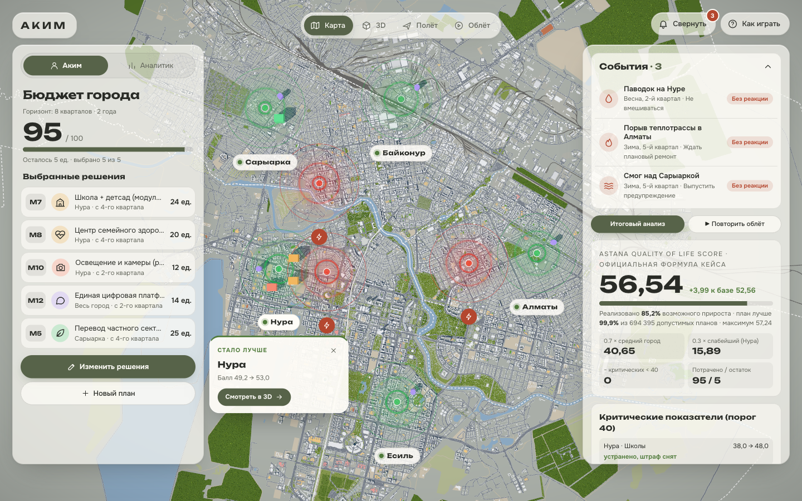
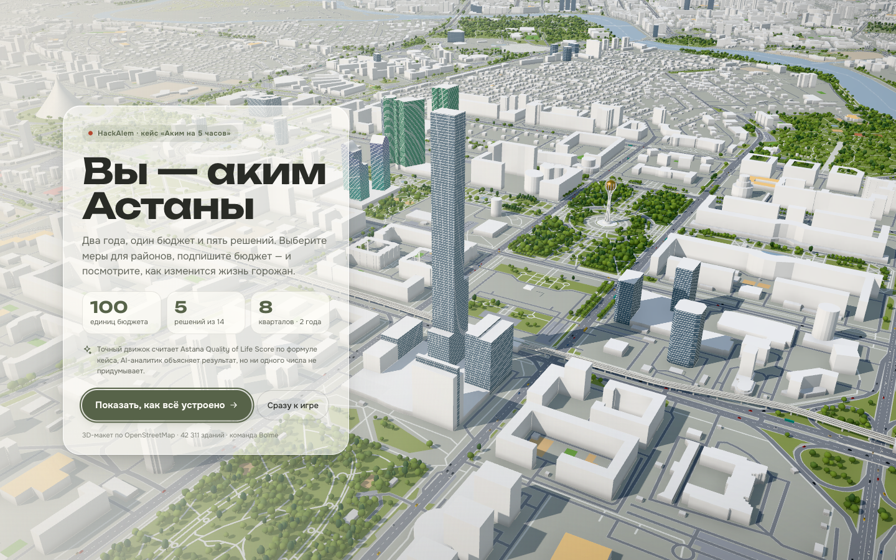
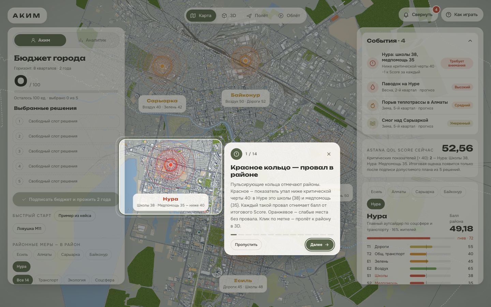
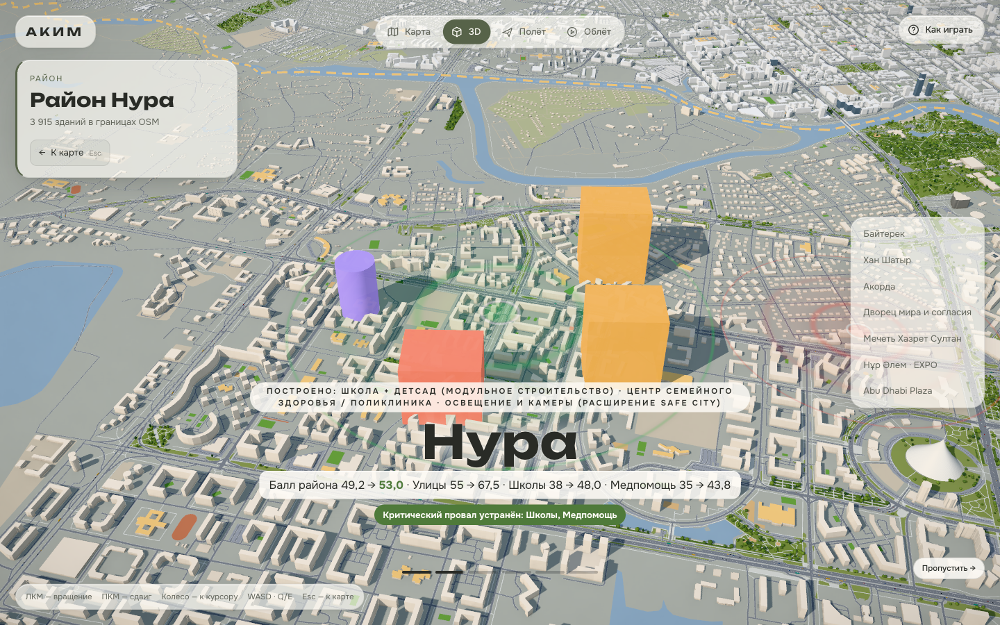
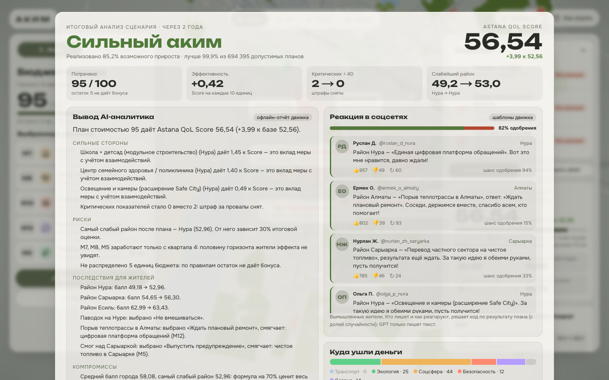
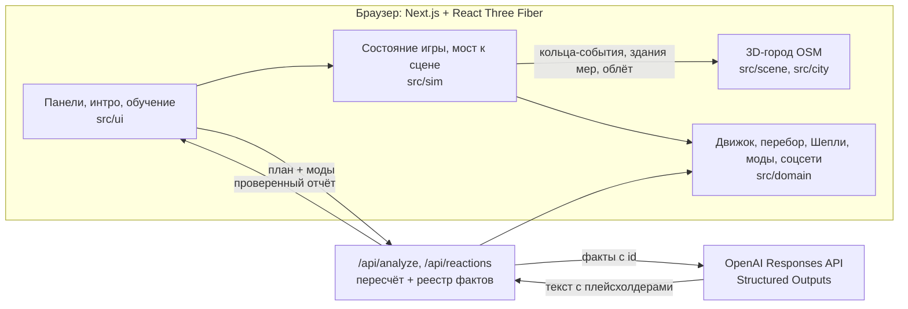
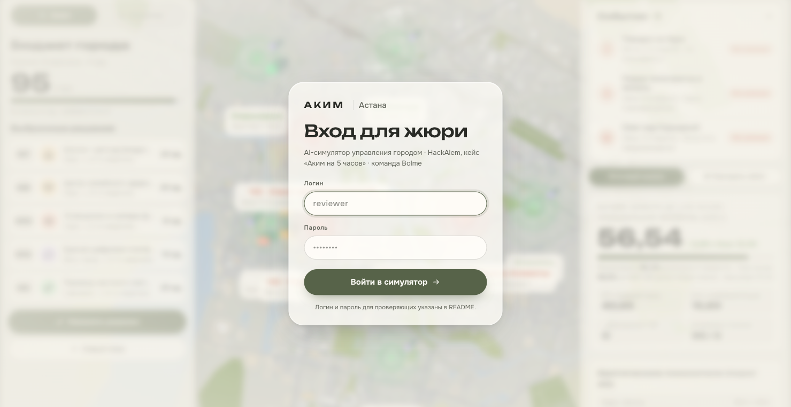

# АКИМ — AI-симулятор управления Астаной

**HackAlem AI · кейс «Аким на 5 часов» · команда Bolme: Сабыржан и Али Назар**

Вы — аким Астаны. У вас два года, бюджет 100 единиц и ровно пять решений. Вы выбираете меры на настоящей 3D-карте города (OpenStreetMap, 42 311 зданий) и подписываете бюджет. Затем видите, как изменились районы.

Точный движок считает **Astana Quality of Life Score** по формуле кейса. AI-аналитик объясняет сильные стороны, риски, последствия и компромиссы, но **ни одного числа не придумывает**: все цифры он берёт из расчёта движка.



## Демо и доступ для жюри

| | |
| --- | --- |
| **Демо** | **https://hackalem.vercel.app** |
| **Логин** | `reviewer` |
| **Пароль** | `Akim-Astana-2026` |
| **Браузер** | Chrome, Edge или Safari с WebGL 2, экран от 1280 px |

Демо открывается со страницы входа для жюри. После входа начинается интро и обучение. Локально (`npm run dev`) страницы входа нет, приложение открывается сразу.

**Навигация:** [Проверка за 3 минуты](#проверка-за-3-минуты) · [Возможности](#возможности) · [Соответствие кейсу](#соответствие-кейсу) · [Код и AI](#что-считает-код-и-что-делает-ai) · [Моды](#моды-города) · [Дизайн](#дизайн) · [Архитектура](#архитектура) · [Эталонные расчёты](#эталонные-расчёты) · [Запуск](#локальный-запуск) · [Деплой](#деплой) · [Codex](#codex-в-разработке) · [Развитие](#ограничения-и-развитие)

## Проверка за 3 минуты

1. **Откройте демо и войдите:** `reviewer` / `Akim-Astana-2026`.
2. **Интро.** За карточкой «Вы — аким Астаны» камера облетает город. Нажмите **«Показать, как всё устроено»**.
3. **Обучение из 14 шагов** подсвечивает каждую часть интерфейса:
   - красное кольцо Нуры;
   - «События» и колокольчик, который сворачивает правую панель;
   - Score;
   - район, бюджет, режимы, каталог мер, моды;
   - подпись бюджета и режимы камеры.

   Пройти его снова можно кнопкой **«Как играть»** справа вверху.
4. Слева нажмите **«Быстрый старт → Пример из кейса»**, затем **«Подписать бюджет и прожить 2 года»**.
5. **Облёт «Прошло 2 года».** Камера пролетает над районами, где изменения сильнее всего. У каждого района подпись с баллом «до → после».
6. **Итоговый анализ.** Ожидаемо:
   - звание «Сильный аким»;
   - потрачено **95 / 100**;
   - **Score 56,54** (+3,99 к базе 52,56);
   - критических показателей **2 → 0**;
   - план лучше **99,9%** из **694 395** допустимых планов, реализовано **85,2%** возможного прироста.
7. **«Ловушка M11».** Нажмите **«Новый план» → «Ловушка M11»** и подпишите. Безопасные переходы в Алматы опускают «Дороги» с 40 до 38,25, появляется новый провал. Score **52,42** оказывается ниже, чем если ничего не делать.

AI-анализ работает и без ключа OpenAI: показывается детерминированный отчёт движка с пометкой «офлайн-отчёт». С ключом отчёт пишет GPT по тем же фактам.

## Возможности

### Интро и обучение

| Интро поверх облёта | Обучение со спотлайтом |
| --- | --- |
|  |  |

- **Интро.** Первый экран объясняет правила, пока за стеклянной карточкой идёт облёт Астаны по ориентирам.
- **Обучение.** 14 шагов. Экран затемняется, нужный элемент подсвечивается рамкой, рядом карточка с объяснением. Управление: «Далее», «Назад», стрелки, `Esc`.
- **«Как играть»** в правом верхнем углу запускает обучение заново.

### Карта и события

- **Кольца-«камни в воде».** Кольцо пульсирует над каждым районом:
  - красное — показатель ниже критической черты 40 (в Нуре: школы 38 и медпомощь 35);
  - оранжевое — слабые места без провала;
  - после подписи — зелёное там, где стало заметно лучше.

  На карте под кольцом только короткая метка с названием района, у ЧС — значок молнии, поэтому подписи не перекрывают друг друга. Клик по метке открывает карточку с деталями и кнопкой «Смотреть в 3D».
- **Карточка «События».** Что требует внимания: провалы ниже 40 по районам и ЧС за два года. У ЧС есть оценка тяжести: «Высокий», «Средний» или «Умеренный». Тяжесть считается из суммарной потери показателей. После подписи карточка показывает, как вы отреагировали на каждую ЧС. Клик по событию наводит на него камеру.
- **Колокольчик «События»** справа вверху сворачивает правую панель, чтобы видеть город целиком. События продолжают прилетать в него: счётчик показывает, сколько их, и краснеет, если есть срочные.
- **Режимы камеры:** `M` — карта сверху, `3` — объёмный 3D-вид, `F` — полёт (WASD, `E`/`Space` выше, `Q`/`C` ниже, `Shift` быстрее), `T` — кинематографичный облёт. `Esc` возвращает к карте.

### План акима

- **Бюджет города:** потрачено из 100, остаток и число выбранных решений из 5.
- **Выбранные решения:** у каждой меры код, иконка, район, квартал начала работы и стоимость.
- **14 мер в 5 направлениях:** транспорт, экология, социальная сфера, безопасность, городской сервис. На карточке меры:
  - цена;
  - с какого квартала мера заработает;
  - какие показатели поднимет ↑ или опустит ↓;
  - синергии ⚡ и конфликты ⛔.

  Районную меру назначают в выбранный район, городская действует сразу на все пять.
- **Проверка правил.** Карточку, нарушающую правила, система не примет и объяснит причину: превышение бюджета, шестое решение, повтор, третья мера одного направления или несовместимость.
- **«Аким» и «Аналитик».** В режиме «Аким» (по умолчанию) результат скрыт до подписи, как у настоящего акима. «Аналитик» включает живой прогноз: Score плана пересчитывается под бюджетом при каждом клике, на каждой карточке виден прирост «+X к Score, если добавить сейчас», у выбранных решений — их вклад, а кольца на карте меняют цвет по прогнозу.
- **Район под микроскопом:** десять показателей района, критическая черта 40 и шкала недовольства жителей.

### После подписи

| Облёт «Прошло 2 года» | Итоговый анализ |
| --- | --- |
|  |  |

- **Облёт «Прошло 2 года».** Камера пролетает до четырёх районов, где прирост больше всего. Подписи считает движок:
  - какие меры построены;
  - балл района «до → после»;
  - главные изменения показателей;
  - устранённые провалы.

  Облёт можно пропустить или повторить.
- **Итоговый анализ** на весь экран:
  - звание акима по доле реализованного потенциала: от «Аким-стажёр» до «Легендарный аким»;
  - Score, эффективность на 10 единиц бюджета, критические показатели, слабейший район;
  - вывод AI: сильные стороны, риски, последствия для жителей, компромиссы, рекомендации;
  - куда ушли деньги по направлениям;
  - как поступил бы лучший аким.
- **Реакция в соцсетях.** Вымышленные жители пишут о ваших мерах, обещаниях и ЧС. Кто пишет, шанс одобрения, лайки и дизлайки считает код. Результат детерминирован: seed берётся из плана, поэтому один и тот же план даёт одну и ту же ленту.
- **Место среди всех планов:** доля реализованного потенциала, ранг среди 694 395 допустимых планов, районы до и после, точный вклад каждой меры по Шепли.
- **«Как улучшить».** Проверенные движком одиночные замены с приростом Score. Каждую можно применить одной кнопкой.
- **«Призрак оптимума»** показывает на карте лучший из 694 395 планов.
- **Бриф для презентации** собирает решение на одну страницу для печати или PDF.

## Соответствие кейсу

### Must have

| Требование кейса | Реализация |
| --- | --- |
| Единый виртуальный бюджет | 100 единиц; датасет кейса перенесён 1:1 в [`src/domain/data.ts`](src/domain/data.ts) |
| Решения по 5 направлениям | 14 мер в пяти направлениях, ровно 5 решений, выбор района для районных мер |
| Автоматический контроль бюджета | Карточка сверх бюджета блокируется с причиной; сервер `/api/analyze` пересчитывает план и отклоняет недопустимый |
| AI-анализ решений | `/api/analyze`: OpenAI Responses API + Structured Outputs по фактам движка ([`route.ts`](src/app/api/analyze/route.ts)) |
| Итоговый Astana QoL Score | Точная формула в [`src/domain/engine.ts`](src/domain/engine.ts) |
| Сильные стороны, риски, последствия | Экран «Итоговый анализ»: звание акима, ключевые показатели, вывод AI (сильные стороны, риски, последствия для жителей, компромиссы, рекомендации), сравнение с лучшим планом |

### Опционально

| Опция кейса | Реализация |
| --- | --- |
| Визуализация изменений районов | 3D-карта: здания мер, кольца с баллом «до → после», облёт «Прошло 2 года», таблица районов и показателей |
| AI-рекомендации по улучшению | Движок перебирает все одиночные замены и переносы; AI объясняет только проверенные варианты. Плюс «призрак» глобального оптимума |
| Неожиданные городские события | Мод «ЧС»: паводок, порыв теплотрассы, смог. Реагирование оплачивается из остатка бюджета |
| Краткая презентация решения | «Бриф для презентации» → печать / PDF |
| Сравнение нескольких команд | Не реализовано, в [планах развития](#ограничения-и-развитие) |

### Критерии проверки → автоматические тесты

42 теста, запуск `npm test`. Критерии кейса проверяются в [`src/domain/engine.test.ts`](src/domain/engine.test.ts), лента соцсетей — в [`src/domain/social.test.ts`](src/domain/social.test.ts).

| Критерий кейса | Тест |
| --- | --- |
| Все начинают с одинакового бюджета и данных | `A1 same budget and data`: бюджет 100, базовый Score 52.55768, баллы всех районов по таблице |
| Нельзя превысить бюджет | `A2 budget cannot be exceeded`: план > 100 получает `ok:false`, код `BUDGET`, Score нет; карточка сверх бюджета блокируется |
| Решения влияют на показатели | `A3 decisions change indicators`: районный и городской охват, лаг, синергия, клиппинг, порог ровно 40, отрицательный эффект M11 |
| AI объясняет результат и компромиссы | Отчёт строится только из фактов движка; пункты с числами вне расчёта отбрасываются ([`report.ts`](src/sim/report.ts)); офлайн-отчёт при сбое |
| Другие решения → другой Score | `A5 changing decisions changes the Score`: пример кейса 56.54307 против оптимума 57.236735 |

## Что считает код и что делает AI

| Код (детерминированно) | AI (GPT через OpenAI Responses API) |
| --- | --- |
| Валидация плана, бюджет, лаги `(8−L)/8`, синергии, клиппинг, D районов, Score | Объясняет, почему Score изменился, простым языком для управленца |
| Полный перебор 694 395 допустимых планов: максимум, ранг, доля потенциала | Формулирует сильные стороны, риски, последствия и компромиссы |
| Точный вклад мер по Шепли (32 подмножества, сумма = прирост) | Выбирает, какие рассчитанные факты важны для вывода |
| Лучшие одиночные замены плана | Рекомендует только из проверенных движком замен |
| Моды: ЧС, недовольство, обещания; лента соцсетей: авторы, шансы, реакции | Упоминает нарушенные обещания и реакцию на ЧС; переписывает тексты постов живым языком |

**Защита от выдуманных чисел.**
- Сервер пересчитывает план и собирает реестр фактов с `id`.
- Модель пишет числа только плейсхолдерами (`{{score}}`, `{{nura_S1_after}}`), формат ответа задаёт строгая JSON-схема.
- Код подставляет значения из реестра.
- Пункт с неизвестным `id` или с «сырым» числом вне реестра отбрасывается.
- В постах соцсетей (`/api/reactions`) GPT меняет только текст. Если в тексте появилась цифра, которой нет среди фактов поста, остаётся шаблонный текст движка.
- Без ключа, при ошибке или таймауте показывается отчёт, собранный кодом из тех же фактов.

## Моды города

Моды включаются справа до подписи бюджета. **Официальный Score они не меняют**: у них отдельный, явно подписанный результат. Коэффициенты модов — игровые допущения команды, а не прогноз для Астаны. События одинаковы для всех игроков.

- **ЧС.** Три события за два года:
  - паводок на Нуре (весна, 2-й квартал);
  - порыв теплотрассы в Алматы (зима, 5-й квартал);
  - смог над Сарыаркой (зима, 5-й квартал).

  Реагировать можно из остатка бюджета, поэтому неиспользованный резерв становится страховкой. Выбранные меры смягчают удар: M13 в районе, M14 по городу, M5 и M6 против смога. Итог — «Score с учётом ЧС» (игровой, не официальный).
- **Шкала недовольства** (0–100 по району). Растёт от критических показателей, отставания от города, брошенных ЧС и нарушенных обещаний. Падает, когда проблемы устранены и жизнь заметно улучшилась.
- **Память народа.** До подписи вы даёте до трёх публичных обещаний, например «Уберу вторую смену в школах Нуры». После подписи код проверяет каждое обещание по показателям. Нарушенное обещание злит район, и AI-анализ его припоминает.
- **Реакция в соцсетях** на экране итогового анализа:
  - код ([`src/domain/social.ts`](src/domain/social.ts)) решает, кто пишет и о чём;
  - шанс одобрения зависит от результата района, недовольства, обещаний и реакции на ЧС;
  - исход — «бросок» с фиксированным seed от плана;
  - лайки и дизлайки тоже считает код, а GPT только переписывает текст.

## Дизайн

- **Настоящая Астана 1:1.** 42 311 зданий, дороги, река, парки и ориентиры из OpenStreetMap. Байтерек, Хан Шатыр, Ак Орда, Нур Алем и другие смоделированы по реальным контурам. По дорожному графу ездят машины, автобусы и поезда ЛРТ.
- **«Тёплый атлас».** Светлые полупрозрачные панели поверх карты, кнопки-пилюли, линейные иконки у мер и событий.

  | Бумага | Карточка | Чернила | Олива |
  | --- | --- | --- | --- |
  | `#F3F0E8` | `#FFFDF8` | `#292B26` | `#576349` |

- **Цвет несёт смысл:**
  - красный — провал ниже 40;
  - оранжевый — слабое место;
  - зелёный — улучшение;
  - оливковый — действие.
- **Шрифты:** Unbounded для заголовков и цифр, Onest для текста.

## Архитектура



| Путь | Назначение |
| --- | --- |
| `src/domain/` | Чистый TypeScript без React: датасет, типы, `engine.ts` (валидация и формула), `solver.ts` (перебор, замены, Шепли), `rank.ts`, `mods.ts`, `social.ts`, тесты |
| `src/domain/generated/solver.json` | Результат `npm run sim:solve`: оптимумы, Парето-фронт, гистограмма 694 395 планов |
| `src/sim/` | Состояние игры (zustand), факты и офлайн-отчёт, мост «движок → кольца на карте», 3D-слой мер |
| `src/ui/sim/` | Панели: бюджет и выбранные решения, каталог, «События», район и моды, результат, облёт, итоговый анализ, соцсети, бриф |
| `src/ui/onboarding/` | Интро поверх облёта и обучение со спотлайтом; шаги — в `steps.ts` |
| `src/app/api/` | `analyze` — AI-анализ с проверкой фактов; `reactions` — тексты постов соцсетей |
| `src/scene/`, `src/city/`, `scripts/city/` | 3D-Астана 1:1 из OpenStreetMap: камера «карта / 3D / полёт / облёт», ориентиры, районы, транспорт. Подробно — [гайд сцены](docs/city-scene-guide.md) |

Сцена и симулятор связаны только через стор `src/city/store.ts`. Симулятор выставляет кольца-события по районам, ведёт камеру в облёте и подключает свой 3D-слой одной строкой в `CityCanvas.tsx`.

## Эталонные расчёты

Все значения проверяются в `npm test` и совпадают с кейсом.

| Сценарий | Стоимость | Критических | Score |
| --- | ---: | ---: | ---: |
| Без решений (база) | 0 | 2 | 52.55768 |
| Пример из кейса: M7, M8, M10 в Нуре + M12 + M5 в Сарыарке | 95 | 0 | 56.54307 |
| Глобальный оптимум: M2 + M3, M8, M9 в Нуре + M14 | 98 | 0 | 57.236735 |
| Ловушка: M9, M10, M4 в Байконуре + M11 в Алматы + M12 | 61 | 3 | 52.42382 |
| Та же ловушка, M11 перенесена в Байконур | 61 | 2 | 53.36453 |
| Строгое прочтение «одна мера на направление», оптимум | 93 | 0 | 56.34451 |

```text
I′ = clip(I + Σ эффект × (8 − L) / 8 + синергия, 0, 100)
D  = Σ w_k × I′_k                 (веса показателей, сумма 1)
Score = 0.7 × Σ pop_d × D_d + 0.3 × min(D) − 1 × (число пар «район × показатель» < 40)
```

**Интерпретации правил.**
- «Не более двух мер одного направления» — по детальным правилам кейса. В его же примере нет транспортной меры. Строгий вариант поддерживает движок (`strictDirections`), его оптимум указан в таблице.
- Промежуточного округления нет.
- Порядок решений не влияет на результат.
- Неполный или недопустимый план итогового Score не получает.

## Локальный запуск

Нужны Node.js 20+ и npm.

```bash
git clone https://github.com/BAITC-Hacks/hack-614786e3-bolme.git
cd hack-614786e3-bolme
npm ci
cp .env.example .env.local   # ключ OpenAI необязателен
npm run dev                  # http://localhost:3000
```

```bash
npm test                     # 42 теста: критерии кейса A1–A5, эталоны, правила, полный перебор, соцсети
npm run typecheck && npm run lint
npm run sim:solve            # пересчитать src/domain/generated/solver.json (~5 с)
npm run build && npm start   # production-сборка
```

| Переменная | Назначение |
| --- | --- |
| `OPENAI_API_KEY` | Ключ OpenAI для живого AI-анализа и текстов соцсетей. Без него работает офлайн-отчёт движка |
| `OPENAI_MODEL` | Модель, по умолчанию `gpt-6-luna` |
| `REVIEWER_LOGIN`, `REVIEWER_PASSWORD` | Логин и пароль страницы входа. Вход включается, только когда заданы обе переменные; без них приложение открывается сразу |

Полезное:
- `?nointro` в адресе пропускает интро;
- `?debug` показывает FPS и статистику сцены.

## Деплой

Демо развёрнуто на Vercel: **https://hackalem.vercel.app**.

```bash
vercel --prod
```

В настройках проекта Vercel заданы `REVIEWER_LOGIN` и `REVIEWER_PASSWORD`: так включается страница входа для жюри. `OPENAI_API_KEY` и `OPENAI_MODEL` можно добавить там же. Без ключа AI-анализ показывает офлайн-отчёт движка.



## Codex в разработке

Codex (OpenAI) использовался на всех этапах:
- четыре независимых анализа кейса: жюри, реализм, геймдизайн, архитектура;
- реализация движка, перебора и тестов по контракту `src/domain/types.ts`;
- лента соцсетей и её тесты.

Журнал с id сессий: [docs/codex-log.md](docs/codex-log.md). Исходные ответы Codex: [docs/research/akim-analysis/codex/](docs/research/akim-analysis/codex/).

## Ограничения и развитие

**Ограничения.**
- Показатели синтетические, из кейса. Симулятор не прогнозирует фактическое развитие Астаны.
- Геометрия города реальная (OSM), но игровые районы — это пять районов кейса. В Астане с 2024 года шесть районов (добавлен Сарайшык).
- Модель кейса не зависит от порядка решений. Соседние районы влияют друг на друга только через городские меры и общий балл.

**Развитие** (спроектировано в [анализе](docs/research/akim-analysis/README.md)).
1. **Сравнение команд** — ссылка-вызов с планом и дуэль планов с AI-комментатором.
2. **Мод «Подрядчики»** — госзакупки: задержки, удорожание, контроль исполнения.
3. **Мод «Последствия»**:
   - перетоки между соседними районами через Есиль;
   - строительный шум и помехи во время лага;
   - эксплуатационные расходы на 3–5-й годы.
4. **Публичные слушания.** Житель самого слабого района оспаривает план, AI проверяет возражения инструментами движка; голос через TTS.
5. **Реальные данные и 6 районов** — открытые данные Астаны вместо синтетики.

## Документация

- [Постановка задачи и критерии оценки](<docs/case/HackAlem AI_ «Аким на 5 часов» - AI-симулятор управления городом.md>)
- [Датасет, мероприятия и правила расчёта](docs/case/akim-simulator-dataset-and-rules.md), [исходные материалы кейса](docs/case/README.md)
- [Анализ кейса: полный перебор, четыре анализа Codex, выбор концепции](docs/research/akim-analysis/README.md)
- [Спецификация симулятора](docs/superpowers/specs/2026-09-23-akim-simulator-design.md)
- [3D-город: устройство сцены и подключение симулятора](docs/city-scene-guide.md)
- [Концепция и визуальный pipeline команды](docs/planning/city-simulator-concept.md)

## Команда Bolme

| | |
| --- | --- |
| **Сабыржан** | 3D-город Астаны из OpenStreetMap, камера и облёт, интерфейс, интро и обучение, деплой |
| **Али Назар** | Движок и формула кейса, полный перебор, AI-анализ, моды, облёт «Прошло 2 года», итоговый анализ, соцсети |

Карта: © OpenStreetMap contributors, ODbL.
