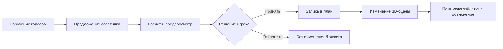
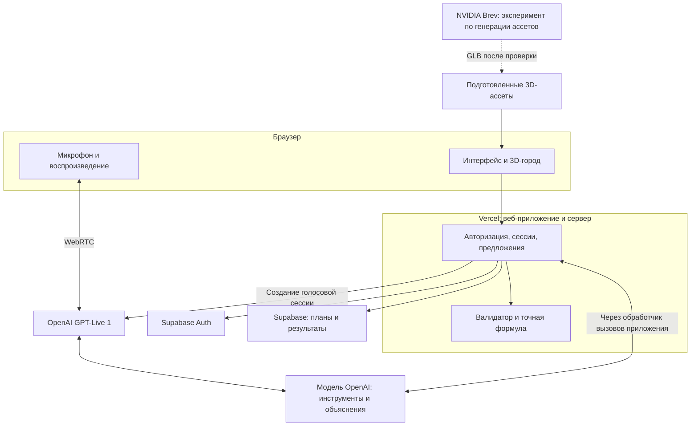

# АКИМ · Город, который слышит ваши решения

**Команда Bolme: Сабыржан и Али Назар · HackAlem · Кейс «Аким на 5 часов»**

Голосовой AI-симулятор управления городом: обсудите инициативу с советником, увидьте её стоимость и последствия, подтвердите решение и наблюдайте изменения на 3D-карте.

> **Статус на 23 сентября 2026:** подготовлены условия, концепция и план реализации. Приложение, вход и деплой ещё не созданы. Численные примеры ниже пересчитаны по формуле задания. Функции продукта описывают целевое поведение.


*Предоставленный командой скриншот [платной модели 3DModels.org](https://3dmodels.org/3d-models/astana-nur-sultan-kazakhstan-70km/). Это внешний референс, не наш ассет и не скриншот приложения. Предлагаем собрать похожий белый макет из открытых данных: [исследование и проверка OSM Астаны](docs/planning/astana-open-data-visual.md). Прежний [сгенерированный концепт](docs/design/city-concept-v1.png) сохранён как ранний вариант.*

**Навигация:** [Доступ для жюри](#доступ-для-жюри) · [Сценарий](#сценарий-демонстрации) · [Архитектура](#архитектура) · [Запуск](#локальный-запуск) · [Проверка](#проверка-расчёта) · [Документация](#документация)

## Ценность

Городские инициативы конкурируют за ограниченный бюджет. Средний балл может скрывать критические проблемы одного района. Симулятор связывает три вещи: понятное предложение, точный расчёт последствий и видимое изменение города.

- **100** условных единиц бюджета.
- **5** решений из **14** доступных мер.
- **5** районов, **10** показателей качества жизни.
- **8** кварталов расчётного горизонта.
- **Один проверяемый результат:** Astana Quality of Life Score.

Показатели синтетические. Для геометрической основы предложены открытые данные Астаны; игровые границы и площадки инициатив условные. Симулятор не прогнозирует фактическое развитие Астаны.

## Доступ для жюри

| Что нужно | Текущий статус |
| --- | --- |
| Ссылка на приложение в Vercel | Будет добавлена после проверенного деплоя |
| Логин демонстрационной учётной записи | Будет добавлен после создания в Supabase Auth |
| Пароль демонстрационной учётной записи | Будет добавлен после проверки входа |
| Локальный адрес приложения | Будет указан после создания и проверки приложения |

По решению команды данные демонстрационного входа публикуются **в этом разделе README**, без показа пароля на странице входа. Это отдельная учётная запись для демонстрации с синтетическими данными. API-ключи OpenAI, серверные ключи Supabase и доступ к Brev в репозиторий не включаются.

При локальном подключении к тому же Supabase работает та же демонстрационная учётная запись. Для собственного Supabase потребуется создать свою учётную запись по будущей инструкции настройки. README не предоставляет ключи для расходования API-бюджета команды при чужом локальном запуске.

## Сценарий демонстрации

1. Войти по данным из раздела выше и открыть город.
2. Сказать советнику: «Предложи поликлинику в Нуре».
3. Увидеть подсвеченный район, полупрозрачное здание и карточку: стоимость 20, показатель S2 изменится с 35 до 43.75 к концу горизонта, лаг 3 квартала.
4. Обсудить предложение. Подтвердить голосом или кнопкой; при отказе план и бюджет сохраняются.
5. Собрать ровно пять допустимых решений и показать город через два условных года.
6. Получить итоговый Score и голосовое объяснение результатов. Сравнение двух планов — расширение после готовности основного сценария.



До пяти допустимых решений показываются изменения отдельных показателей и стоимость. Базовый Score подписан отдельно; неполный набор не выдаётся за итоговый сценарий.

## Архитектура

Подтверждены командой **Vercel + Supabase** и бюджеты **$50 OpenAI API + $50 NVIDIA Brev**. Jev / TypeSafe отложен.



GPT-Live ведёт разговор. Серверная модель предлагает вызовы ограниченных инструментов. Приложение проверяет решения и подтверждение пользователя. Все числа считает движок, включая бюджет, лаги, синергии и итоговый Score.

Основной OpenAI API-ключ хранится на сервере. Вход обязателен для создания платной голосовой сессии и вызовов AI. Для публичной демонстрационной учётной записи нужны серверные лимиты расходов и длительности сессий.

## Локальный запуск

**Приложение пока не создано, поэтому проверенных команд запуска ещё нет.** Сейчас можно клонировать репозиторий и прочитать документацию:

```bash
git clone https://github.com/BAITC-Hacks/hack-614786e3-bolme.git
cd hack-614786e3-bolme
```

До сдачи этот раздел должен содержать проверенные на чистом клоне шаги:

1. Требуемые версии среды и установка зависимостей из lockfile.
2. Копирование `.env.example` и описание каждой переменной без секретных значений.
3. Подключение своего Supabase или разрешённого командой демонстрационного окружения.
4. Применение миграций, загрузка синтетических данных и создание demo-пользователя.
5. Подключение своего OpenAI API-ключа с доступом к выбранным моделям.
6. Точные команды разработки, тестов и production-сборки.
7. Проверка входа, голосового сценария и контрольного Score.

Для микрофона браузеру необходимы HTTPS или localhost. Ручной выбор мер остаётся доступен при отказе в доступе к микрофону. Сбой AI явно отображается и не подменяется сгенерированным заранее ответом.

## Проверка расчёта

| Сценарий | Бюджет | Критические показатели | Score |
| --- | --- | --- | --- |
| Исходное состояние | 0 | 2 | 52.55768 → **52.56** |
| Контрольный план | 95 | 0 | 56.54307 → **56.54** |

Контрольный план: **M7 Нура + M8 Нура + M10 Нура + M12 город + M5 Сарыарка**. Рост относительно базы: **+3.98539**. Источник и полный расчёт — в [описании кейса](docs/case/README.md).

```text
Score = 0.7 × средневзвешенный балл города
      + 0.3 × балл самого слабого района
      − число показателей строго ниже 40
```

Формула применяется после лагов, синергий и ограничения значений диапазоном 0–100. Невалидный набор не получает Score. Эти значения пока проверены независимым арифметическим пересчётом, а не тестами приложения.

## Что показать по критериям жюри

| Критерий | Баллы | Доказательство при сдаче |
| --- | --- | --- |
| Соответствие задаче и работоспособность | 25 | Полный сценарий из пяти допустимых решений |
| Техническая реализация | 25 | Проверяемый движок, реальная интеграция AI, обработка ошибок |
| README и воспроизводимость | 25 | Русская инструкция, рабочие URL и логин, запуск с чистого клона |
| Ценность и применимость | 15 | Понятные последствия распределения ограниченного бюджета |
| Развитие и оригинальность | 10 | Голосовое обсуждение, предпросмотр решения и изменения города |

## Документация

- [Условия, датасет, формула и исходные скриншоты](docs/case/README.md).
- [Постановка задачи и критерии оценки](<docs/case/HackAlem AI_ «Аким на 5 часов» - AI-симулятор управления городом.md>).
- [Датасет, мероприятия и правила расчёта](docs/case/akim-simulator-dataset-and-rules.md) — единый документ по пяти исходным изображениям с проверкой чисел.
- [3D-город: устройство сцены и подключение симулятора](docs/city-scene-guide.md).
- [Концепция, разделение задач и план работы](docs/planning/city-simulator-concept.md).
- [Визуальный pipeline, голосовой сценарий и бюджет](docs/planning/visual-voice-pipeline.md).
- [Белый макет Астаны: бесплатные инструменты и проверенные данные OSM](docs/planning/astana-open-data-visual.md).
- [Промпт изображения-концепта и статус проверки](docs/design/city-concept-v1-prompt.md).
- [Предварительный ресёрч до получения кейса](docs/research/README.md).

При реализации сюда добавляются фактические скриншоты, короткая запись демо, лицензии используемых ассетов, результаты тестов и известные ограничения. Художественный концепт сохраняет свою подпись.
