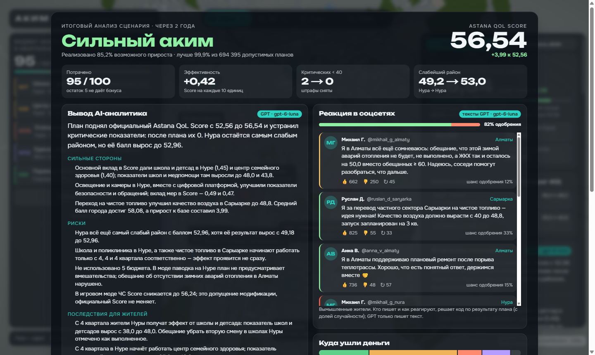
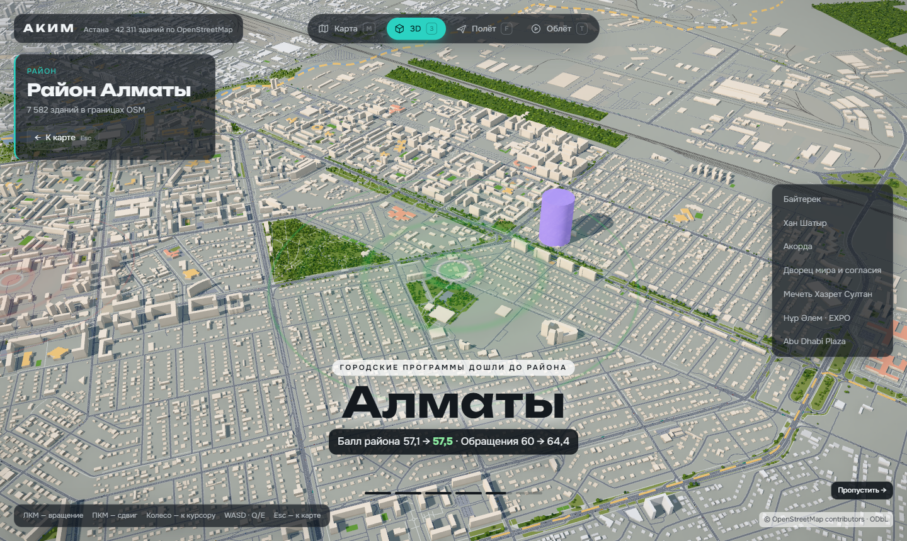
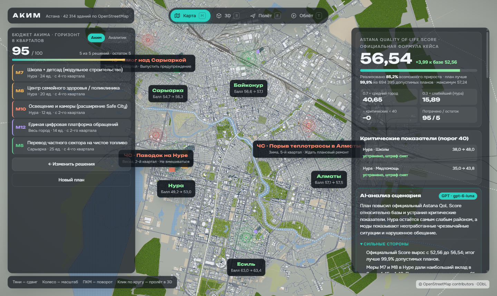
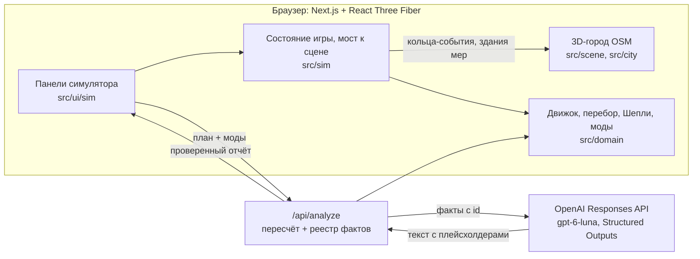

# АКИМ · «Аким на 5 часов» — AI-симулятор управления Астаной

**Команда Bolme: Сабыржан и Али Назар · HackAlem AI · кейс «Аким на 5 часов»**

Вы — аким с бюджетом 100 и пятью решениями на два года. Выбираете меры на настоящей 3D-карте Астаны (OpenStreetMap, 42 314 зданий), подписываете бюджет и видите, как изменились районы. Точный движок считает **Astana Quality of Life Score** по формуле кейса. AI-аналитик объясняет сильные стороны, риски, последствия и компромиссы, но **ни одного числа не придумывает**: все цифры подставляются из расчёта движка.



| Облёт «Прошло 2 года» | Результат на карте |
| --- | --- |
|  |  |

**Навигация:** [Проверка за минуту](#проверка-за-минуту) · [Как играть](#как-играть) · [Соответствие кейсу](#соответствие-кейсу) · [Код и AI](#что-считает-код-и-что-делает-ai) · [Моды](#моды-города) · [Архитектура](#архитектура) · [Эталонные расчёты](#эталонные-расчёты) · [Запуск](#запуск) · [Codex](#codex-в-разработке) · [Развитие](#ограничения-и-развитие)

## Проверка за минуту

Нужны Node.js 20+ и npm. После установки зависимостей:

```bash
git clone https://github.com/BAITC-Hacks/hack-614786e3-bolme.git
cd hack-614786e3-bolme
npm ci
npm test            # 42 теста: критерии кейса A1–A5, эталоны, правила, полный перебор, соцсети
npm run dev         # http://localhost:3000
```

1. Дождитесь загрузки карты. Слева «Бюджет акима», справа состояние города: **Score 52,56**, в Нуре два критических показателя.
2. Нажмите **«Быстрый старт → Пример из кейса»**, затем **«Подписать бюджет и прожить 2 года»**.
3. Ожидаемо: потрачено **95 / 100**, **Score 56,54** (+3,99 к базе), критических показателей 0, план лучше 99,9% из 694 395 допустимых планов.
4. Нажмите **«Ловушка M11»** и подпишите: безопасные переходы в Алматы опускают «Дороги» с 40 до 38,25, появляется новый провал, и Score **52,42** оказывается ниже, чем если ничего не делать.

AI-анализ работает без ключа: показывается детерминированный отчёт движка с пометкой «офлайн-отчёт». С ключом в `.env.local` отчёт пишет GPT (см. [Запуск](#запуск)).

## Как играть

1. **Посмотрите на город.** Кольца на карте отмечают проблемы районов. Справа — десять показателей выбранного района, критическая черта 40 и шкала недовольства жителей.
2. **Выберите 5 мер из 14.** Карточки сгруппированы по пяти направлениям: транспорт, озеленение, социальная инфраструктура, безопасность, городской сервис. Районную меру назначьте в район, городская действует сразу на все пять.
3. **Режим «Аким» (по умолчанию):** результат скрыт до подписи, как у настоящего акима. Видно, что стоит мера, с какого квартала она начнёт работать, какие районы и какие показатели затронет (↑/↓), с чем даёт синергию и с чем конфликтует. **Режим «Аналитик»** показывает величины эффектов и живой прогноз.
4. **Карточку, нарушающую правила, система не примет** и объяснит причину: превышение бюджета, шестое решение, повтор, третья мера направления, несовместимость.
5. **Подпишите бюджет.** Начнётся облёт «Прошло 2 года»: камера пролетает над районами, где изменения сильнее всего. Подписи к каждому району считает движок: балл «до → после», главные показатели, устранённые провалы. Облёт можно пропустить.
6. **Итоговый анализ** — полноэкранный разбор сценария:
   - звание акима по доле реализованного потенциала;
   - Score, эффективность на 10 единиц бюджета, критические показатели, слабейший район;
   - вывод AI: сильные стороны, риски, последствия, компромиссы, рекомендации;
   - реакция жителей в соцсетях;
   - куда ушли деньги по направлениям;
   - как поступил бы лучший аким.

   На карте остаются здания мер. В панели справа — место среди всех допустимых планов, районы до и после и точный вклад каждой меры.
7. **Улучшите план.** Блок «Как улучшить» предлагает проверенные движком замены с приростом Score. «Призрак оптимума» показывает на карте лучший из 694 395 планов.
8. **Бриф для презентации** собирает одностраничное решение команды для печати или PDF.

## Соответствие кейсу

### Must have

| Требование кейса | Реализация |
| --- | --- |
| Единый виртуальный бюджет | 100 единиц; датасет кейса перенесён 1:1 в [`src/domain/data.ts`](src/domain/data.ts) |
| Решения по 5 направлениям | 14 мер в пяти направлениях, ровно 5 решений, выбор района для районных мер |
| Автоматический контроль бюджета | Карточка сверх бюджета блокируется с причиной; сервер `/api/analyze` пересчитывает план и отклоняет недопустимый |
| AI-анализ решений | `/api/analyze`: OpenAI Responses API + Structured Outputs по фактам движка ([`route.ts`](src/app/api/analyze/route.ts)) |
| Итоговый Astana QoL Score | Точная формула в [`src/domain/engine.ts`](src/domain/engine.ts) |
| Сильные стороны, риски, последствия | Экран «Итоговый анализ» после облёта: звание акима, ключевые показатели, вывод AI (сильные стороны, риски, последствия для жителей, компромиссы, рекомендации), сравнение с лучшим планом |

### Опционально

| Опция кейса | Реализация |
| --- | --- |
| Визуализация изменений районов | 3D-карта: здания мер, кольца-события с балл «до → после», таблица районов и показателей |
| AI-рекомендации по улучшению | Движок перебирает все одиночные замены и переносы; AI объясняет только проверенные варианты. Плюс «призрак» глобального оптимума |
| Неожиданные городские события | Мод «ЧС»: паводок, порыв теплотрассы, смог. Реагирование оплачивается из остатка бюджета |
| Краткая презентация решения | «Бриф для презентации» → печать / PDF |
| Сравнение нескольких команд | Не реализовано: в [планах развития](#ограничения-и-развитие) |

### Критерии проверки → автоматические тесты

Тесты: [`src/domain/engine.test.ts`](src/domain/engine.test.ts), запуск `npm test`.

| Критерий кейса | Тест |
| --- | --- |
| Все начинают с одинакового бюджета и данных | `A1 same budget and data`: бюджет 100, базовый Score 52.55768, баллы всех районов по таблице |
| Нельзя превысить бюджет | `A2 budget cannot be exceeded`: план > 100 получает `ok:false`, код `BUDGET`, Score нет; карточка сверх бюджета блокируется |
| Решения влияют на показатели | `A3 decisions change indicators`: районный и городской охват, лаг, синергия, клиппинг, порог ровно 40, отрицательный эффект M11 |
| AI объясняет результат и компромиссы | Отчёт строится только из фактов движка; пункты с числами вне расчёта отбрасываются ([`report.ts`](src/sim/report.ts)); офлайн-отчёт при сбое |
| Другие решения → другой Score | `A5 changing decisions changes the Score`: пример кейса 56.54307 против оптимума 57.236735 |

## Что считает код и что делает AI

| Код (детерминированно) | AI (GPT через OpenAI Responses API) |
| --- | --- |
| Валидация плана, бюджет, лаги `(8−L)/8`, синергии, клиппинг, D районов, Score | Объясняет, почему Score изменился, простым языком для управленца |
| Полный перебор 694 395 допустимых планов: максимум, ранг, доля потенциала | Формулирует сильные стороны, риски, последствия и компромиссы |
| Точный вклад мер по Шепли (32 подмножества, сумма = прирост) | Выбирает, какие рассчитанные факты важны для вывода |
| Лучшие одиночные замены плана | Рекомендует только из проверенных движком замен |
| Моды: ЧС, недовольство, обещания | Упоминает нарушенные обещания и реакцию на ЧС |

**Защита от выдуманных чисел.**
- Сервер пересчитывает план и собирает реестр фактов с `id`.
- Модель пишет числа только плейсхолдерами `{{score}}`, `{{nura_S1_after}}`, строгая JSON-схема задаёт формат ответа.
- Код подставляет значения из реестра.
- Пункт с неизвестным `id` или с «сырым» числом вне реестра отбрасывается.
- Без ключа, при ошибке или таймауте показывается отчёт, собранный кодом из тех же фактов.

## Моды города

Моды включаются справа до подписи бюджета. **Официальный Score они не меняют**: у них отдельный, явно подписанный результат. Коэффициенты модов — игровые допущения команды, а не прогноз для Астаны. События одинаковы для всех игроков.

- **ЧС.** Три события за два года:
  - паводок в Нуре (весна);
  - порыв теплотрассы в Алматы (зима);
  - смог над Сарыаркой (зима).

  Реагировать можно из остатка бюджета, и неиспользованный резерв становится страховкой. Выбранные меры смягчают удар: M13 в районе, M14 по городу, M5 и M6 против смога. Итог — «Score с учётом ЧС» (игровой, не официальный).
- **Шкала недовольства** (0–100 по району) растёт от критических показателей, отставания от города, брошенных ЧС и нарушенных обещаний. Падает, когда проблемы устранены и жизнь заметно улучшилась.
- **Память народа.** До подписи вы даёте до трёх публичных обещаний, например «Уберу вторую смену в школах Нуры». После подписи код проверяет каждое по показателям. Нарушенное обещание злит район, и AI-анализ его припоминает.
- **Реакция в соцсетях** (на экране итогового анализа). Вымышленные жители пишут о ваших мерах, обещаниях и ЧС.
  - Код ([`src/domain/social.ts`](src/domain/social.ts)) решает, кто пишет и о чём, и считает шанс одобрения по результату района, недовольству, обещаниям и реакции на ЧС.
  - Исход — «бросок» с фиксированным seed от плана: тот же план даёт ту же ленту.
  - Лайки и дизлайки тоже считает код. GPT только переписывает текст поста живым языком и не может добавить чисел, которых нет в фактах поста.

## Архитектура



| Путь | Назначение |
| --- | --- |
| `src/domain/` | Чистый TypeScript без React: датасет, типы, `engine.ts` (валидация и формула), `solver.ts` (перебор, замены, Шепли), `rank.ts`, `mods.ts`, тесты |
| `src/domain/generated/solver.json` | Результат `npm run sim:solve`: оптимумы, Парето-фронт, гистограмма 694 395 планов |
| `src/sim/` | Состояние игры (zustand), факты и офлайн-отчёт, мост «движок → кольца на карте», 3D-слой мер |
| `src/ui/sim/` | Панели: бюджет и каталог, район и моды, результат, AI-анализ, бриф |
| `src/app/api/analyze/` | Серверный AI-анализ с проверкой фактов |
| `src/scene/`, `src/city/`, `scripts/city/` | 3D-Астана 1:1 из OpenStreetMap: камера «карта / 3D / полёт / облёт», ориентиры, районы. Подробно — [гайд сцены](docs/city-scene-guide.md) |

Сцена и симулятор связаны только через стор `src/city/store.ts`: симулятор выставляет кольца-события по районам и подключает свой 3D-слой одной строкой в `CityCanvas.tsx`.

## Эталонные расчёты

Все значения проверяются в `npm test` и совпадают с кейсом.

| Сценарий | Стоимость | Критических | Score |
| --- | ---: | ---: | ---: |
| Без решений (база) | 0 | 2 | 52.55768 |
| Пример из кейса: M7, M8, M10 в Нуре + M12 + M5 в Сарыарке | 95 | 0 | 56.54307 |
| Глобальный оптимум: M2 + M3, M8, M9 в Нуре + M14 | 98 | 0 | 57.236735 |
| Ловушка: M9, M10, M4 в Байконуре + M11 в Алматы + M12 | 61 | 3 | 52.42382 |
| Та же ловушка, M11 перенесена в Байконур | 61 | 2 | 53.36453 |
| Строгое прочтение «одна мера на направление», оптимум | 93 | 0 | 56.34451 |

```text
I′ = clip(I + Σ эффект × (8 − L) / 8 + синергия, 0, 100)
D  = Σ w_k × I′_k                 (веса показателей, сумма 1)
Score = 0.7 × Σ pop_d × D_d + 0.3 × min(D) − 1 × (число пар «район × показатель» < 40)
```

**Интерпретации правил.**
- «Не более двух мер одного направления» — по детальным правилам кейса. В его же примере нет транспортной меры. Строгий вариант поддерживает движок (`strictDirections`), его оптимум указан в таблице.
- Промежуточного округления нет.
- Порядок решений не влияет на результат.
- Неполный или недопустимый план итогового Score не получает.

## Запуск

```bash
npm ci
cp .env.example .env.local   # вставьте OPENAI_API_KEY (необязательно)
npm run dev                  # http://localhost:3000
npm test                     # тесты движка
npm run typecheck && npm run lint
npm run sim:solve            # пересчитать src/domain/generated/solver.json (~5 с)
npm run build && npm start   # production-сборка
```

| Переменная | Назначение |
| --- | --- |
| `OPENAI_API_KEY` | Ключ OpenAI для живого AI-анализа. Без него работает офлайн-отчёт движка |
| `OPENAI_MODEL` | Модель, по умолчанию `gpt-6-luna` |

`?debug` в адресе показывает FPS и координаты сцены. Клавиши: `M` — карта, `3` — 3D, `F` — полёт, `T` — облёт.

## Codex в разработке

Codex (OpenAI) использовался на всех этапах:
- четыре независимых анализа кейса: жюри, реализм, геймдизайн, архитектура;
- реализация движка, перебора и тестов по контракту `src/domain/types.ts`.

Журнал с id сессий: [docs/codex-log.md](docs/codex-log.md). Исходные ответы Codex: [docs/research/akim-analysis/codex/](docs/research/akim-analysis/codex/).

## Ограничения и развитие

**Ограничения.**
- Показатели синтетические, из кейса. Симулятор не прогнозирует фактическое развитие Астаны.
- Геометрия города реальная (OSM), но игровые районы — это пять районов кейса. В Астане с 2024 года шесть районов (добавлен Сарайшык).
- Модель кейса не зависит от порядка решений. Соседние районы влияют друг на друга только через городские меры и общий балл.

**Развитие** (спроектировано в [анализе](docs/research/akim-analysis/README.md)).
1. **Сравнение команд** — ссылка-вызов с планом и дуэль планов с AI-комментатором.
2. **Мод «Подрядчики»** — госзакупки: задержки, удорожание, контроль исполнения.
3. **Мод «Последствия»**:
   - перетоки между соседними районами через Есиль;
   - строительный шум и помехи во время лага;
   - эксплуатационные расходы на 3–5 годы.
4. **Публичные слушания:** житель самого слабого района оспаривает план, AI проверяет возражения инструментами движка; голос через TTS.
5. **Реальные данные и 6 районов** — открытые данные Астаны вместо синтетики.

## Документация

- [Постановка задачи и критерии оценки](<docs/case/HackAlem AI_ «Аким на 5 часов» - AI-симулятор управления городом.md>)
- [Датасет, мероприятия и правила расчёта](docs/case/akim-simulator-dataset-and-rules.md), [исходные материалы кейса](docs/case/README.md)
- [Анализ кейса: полный перебор, четыре анализа Codex, выбор концепции](docs/research/akim-analysis/README.md)
- [Спецификация симулятора](docs/superpowers/specs/2026-09-23-akim-simulator-design.md)
- [3D-город: устройство сцены и подключение симулятора](docs/city-scene-guide.md)
- [Концепция и визуальный pipeline команды](docs/planning/city-simulator-concept.md)

Карта: © OpenStreetMap contributors, ODbL.
