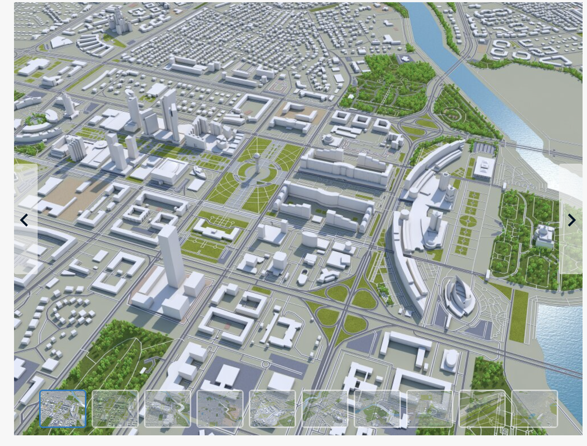
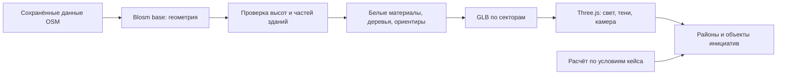

# Астана из открытых данных: визуал архитектурного макета

Исследование от 23 сентября 2026. Этап: концепция и ТЗ. Приложение и 3D-модель ещё не собраны; проверены документация инструментов и небольшой реальный фрагмент OSM.

## Вывод

Предлагаемый основной путь: **OpenStreetMap → Blosm base в Blender → художественная доработка → GLB по секторам → Three.js / React Three Fiber**.

Похожий визуальный язык бесплатной сцены представляется достижимым: белая застройка, дороги, зелёные парки, голубая река, выразительные тени и несколько узнаваемых ориентиров. Это инженерная оценка, пока не результат рендера. Точное соответствие платному файлу по всем зданиям, деталям и охвату не подтверждено.

Предоставленный командой референс становится актуальным ориентиром вместо прежнего фотореалистичного изображения. Генерация всего города через AI для этого направления не нужна.

## Что именно нравится в референсе

Источник референса: [Astana / Nur-Sultan, Kazakhstan, 70km, 3DModels.org](https://3dmodels.org/3d-models/astana-nur-sultan-kazakhstan-70km/). Скриншот предоставлен пользователем. Это чужой визуальный референс, не наш ассет и не кадр нашего приложения. Цена около $200 сообщена командой. При прямой проверке сайт вернул блокировку Cloudflare, поэтому происхождение геометрии, комплектацию, число полигонов и лицензию платного файла независимо не подтвердили. Название «70km» само по себе не устанавливает площадь или диаметр охвата.

По скриншотам выразительность создают:

- узнаваемые контуры кварталов и разнообразные высоты зданий;
- отдельные силуэты Байтерека и других крупных объектов;
- широкие дороги, развязки, бордюры и тонкие линии дорожек;
- повторяющиеся объёмные деревья поверх зелёных территорий;
- голубая река и мосты;
- светлые материалы, направленные тени, затемнение у основания объектов;
- камера высоко над городом, где важнее силуэты, чем текстуры окон.

Это стиль архитектурного макета. Его можно развивать в интерактивной сцене без детализированных фасадов каждого дома. Качество крупных планов и общего вида следует оценивать отдельно.

## Что есть в реальных данных Астаны

Выполнен небольшой запрос к [официальному OSM API](https://api.openstreetmap.org/api/0.6/map.json?bbox=71.420,51.123,71.438,51.132) для участка вокруг Байтерека. Прямоугольник запроса: запад 71.420, юг 51.123, восток 71.438, север 51.132; примерно 1.3 × 1 км.

| Признак в ответе API | Проверенное количество |
| --- | ---: |
| Элементы с тегом `building` | 118: 105 ways и 13 relations |
| Из них имеют `height` | 2 |
| Из них имеют `building:levels` | 66 |
| Из них имеют хотя бы высоту или этажность | 66 |
| Элементы `building:part` | 46 |
| Части с высотой или этажностью | 34 |

Это количество элементов OSM, а не очищенный список отдельных физических зданий. Контуры могут выходить за границы запроса; части считаются отдельно. Отсутствие высоты у основного контура не означает, что она отсутствует у всех его частей. Выборка не характеризует покрытие всего города.

У части Байтерека `way/230401644` есть `building:part=yes`, `building:levels=30`, `roof:shape=orb`. Это полезные исходные признаки, но они не доказывают, что конкретный импортёр правильно восстановит шар и опоры. Метки этажности тоже не заменяют проверенную высоту необычного сооружения.

Сводка и выбранные теги сохранены в [astana-osm-sample.json](../research/astana-osm-sample.json). Основной вывод: геометрическая основа существует, но ожидать автоматической точной высоты и формы каждого здания нельзя.

Два запроса к публичным Overpass-серверам не дали данных: один вернул Not Acceptable, другой завершился таймаутом. Затем небольшой запрос к основному OSM API успешно выполнен. Для реализации нужен сохранённый локальный фрагмент данных; загрузку OSM нельзя ставить на пути каждой игровой сессии. Большой городской фрагмент следует получать через подходящую выгрузку или Overpass частями, а не массовыми запросами к редакторскому API.

## Сравнение инструментов

| Вариант | Подтверждённые возможности | Роль для нашей задачи |
| --- | --- | --- |
| **Blosm base** | Бесплатная версия; высоты и этажность, части зданий, разные крыши; дороги с шириной, вода и растительность как полигоны | **Основной кандидат**: хорошо соответствует белому макету, результат можно дорабатывать в Blender |
| **BlenderGIS** | Импорт OSM XML и запросы Overpass; GIS-слои, геопривязка и рельеф | Полезный GIS-инструмент, но сам импорт не создаёт законченное оформление референса |
| **OSM2World** | Открытый генератор геометрии OSM; экспорт glTF/GLB/OBJ, уровни детализации, поддержка дорожной разметки и множества тегов | Сильный альтернативный конвертер, особенно для автоматизации; требуется проверить вид и настройки на том же участке |
| **MapLibre** | Интерактивная карта и экструзия зданий по высоте; официальный пример использует векторные тайлы | Быстрый запасной путь для работающей карты; базовый пример не подтверждает качество теней, деревьев и ориентиров уровня референса |

Источники: [Blosm README](https://github.com/vvoovv/blosm), [BlenderGIS: OSM import](https://github.com/domlysz/BlenderGIS/wiki/OSM-import), [OSM2World](https://osm2world.org/), [MapLibre: здания в 3D](https://maplibre.org/maplibre-gl-js/docs/examples/display-buildings-in-3d/).

В [подробной документации Blosm base](https://github.com/vvoovv/blender-osm/wiki/Documentation) описаны импорт локального OSM-файла, полигоны с отверстиями, перевод дорожных кривых в mesh, раздельные объекты с OSM-тегами и сохранение общего начала координат между импортами. По умолчанию инструмент может варьировать высоту этажа и случайно выбирать этажность при пропусках: для воспроизводимости сохраняем итоговую сцену и настройки, а приближения контролируем отдельно.

**Граница бесплатного Blosm:** импорт лесов и одиночных деревьев именно как 3D-объектов, автоматические текстурированные материалы и ряд других функций перечислены в Pro. Бесплатная версия даёт полигоны растительности. Для нашего стиля предлагаем самостоятельно расставлять несколько повторяемых моделей деревьев внутри этих полигонов, исключая дороги, воду и здания. Расстановка декоративная, не точный кадастр деревьев.

У OSM2World также появилась [веб-библиотека](https://osm2world.org/docs/library-web/), но авторы отмечают её новизну и рекомендуют небольшие наборы данных. Для хакатона предпочтительнее подготовить геометрию заранее и загрузить готовые ассеты. Номер версии конвертера и используемый стиль необходимо закрепить; содержимое latest может меняться.

## Предлагаемый pipeline

1. **Один участок.** Начать с примерно 1–2 км вокруг Байтерека; после проверки расширить до набережной. Контрольный запрос выше не включает всю реку и весь город.
2. **Импорт.** Сохранить здания и их части, дороги, дорожки, водные и зелёные полигоны. Не накладывать полную экструзию контура поверх уже созданных частей. Проверить дворы с отверстиями, мосты и высотные уровни.
3. **Высоты.** Использовать указанную высоту, затем этажность с выбранной оценкой высоты этажа; при отсутствии обоих — явное приближение по типу здания. Результаты приближений маркировать в данных, не выдавать за обмер.
4. **Ориентиры.** Проверить Байтерек в импортированном участке. Если силуэт плохой — сделать собственную упрощённую модель и заменить только этот объект. Затем ещё 1–2 ориентира внутри выбранного охвата, если позволяет время. AI-генерация здесь необязательна.
5. **Окружение.** Светло-серые здания, графитовые дороги, тонкие светлые дорожки, сдержанная зелень, голубая вода. Деревья повторяются с небольшими вариациями; автоматическую точность дорожной разметки не предполагаем.
6. **Подготовка для веба.** Привести масштаб к метрам и общему локальному началу координат. Преобразовать нужные кривые в геометрию перед экспортом. Проверить итоговый GLB; не считать красивый Blender-рендер доказательством качества веб-сцены.
7. **Оптимизация.** Небольшие пространственные сектора, объединение статической геометрии по материалам, повторное использование деревьев, упрощение дальнего плана. Сохранить отдельно метаданные для выбора объектов. Инициативы и ориентиры оставить независимыми.
8. **Отрисовка.** В браузере настроить свет, тени, мягкое затемнение контактов, воду, сглаживание и камеру. Основной стиль воспроизводится здесь, а не автоматически переносится из рендера Blender.
9. **Игра.** Поверх подготовленной геометрии разместить условные игровые районы и заранее выбранные площадки. Школы, клиники, парки и автобусные полосы появляются отдельными объектами по подтверждённым решениям.

Большой статический город не нужно пересчитывать при голосовой команде. Меняются только объекты инициатив, подсветка и показатели. Это совместимо с выбранными Vercel, Supabase и голосовым советником.

## Охват и пять районов

Красивый центральный участок не покрывает все пять районов кейса. Для продукта нужны обзор города и пять доступных игровых зон; подробный центр служит первым эталоном качества. Другие участки можно загружать секторами и отображать проще на общей карте.

Геометрия улиц и зданий может происходить из настоящих данных Астаны, тогда как показатели, площадки инициатив и игровые границы остаются условными. Не подписывать произвольное разбиение центра как точные административные районы. Проверка действующих административных границ не проводилась.

## Качество, которое можно обещать после проверки

| Составляющая | Ожидание | Что пока не доказано |
| --- | --- | --- |
| Белый архитектурный стиль | Подход хорошо соответствует референсу | Реальный браузерный кадр |
| Узнаваемая планировка | Подтверждены доступные OSM-данные маленького участка | Полнота большого охвата |
| Высотность и сложные крыши | Использовать теги и доработать ключевые объекты | Точное соответствие каждому зданию |
| Парки, деревья, свет | Создаются отдельным художественным проходом | Скорость подготовки и FPS |
| Интерактивность | Камера, выбор зоны, preview и отдельные инициативы заложены в план | Рабочий сценарий приложения |
| Вся модель «70km» | Для первого демо не требуется | Сопоставимая детализация по всему платному охвату |

Вместо субъективного обещания «90% качества» нужен один проверяемый эталон:

- узнаваемый участок с одним ориентиром, дорогой, зеленью и разными высотами;
- два реальных кадра: общий план и приближение;
- 10–15 секунд движения камеры;
- появление полупрозрачной клиники и принятие её в план;
- измеренный FPS на ноутбуке команды.

Рабочий бюджет первой проверки после старта разработки: 45–60 минут, **оценка, не гарантия**, установка инструментов может увеличить срок. При неудаче не расширять импорт на весь город: сначала упростить геометрию или проверить альтернативный конвертер. Цель производительности: 1080p и минимум 30 FPS в демонстрационном сценарии; пока не измерено.

## Деньги и воспроизводимость

Для основы OSM + бесплатный Blosm покупка модели не требуется. Главная затрата — время подготовки. NVIDIA Brev не нужен для импорта векторной геометрии и не увеличивает FPS браузера. Облачную генерацию отдельных объектов можно оставить на потом; бюджет $50 Brev сохраняется отдельно от $50 OpenAI для голоса.

Данные OSM распространяются по ODbL. Нужна видимая атрибуция OpenStreetMap contributors и ссылка на лицензию; для распространяемых производных данных учитывать условия ODbL. Лицензии библиотек, геоданных и дополнительных моделей фиксируются отдельно. [Официальные условия OSM](https://www.openstreetmap.org/copyright).

В русской инструкции будущей реализации указать источник и дату выгрузки, bbox, версии инструментов, ручные изменения, правила приближённых высот, экспорт, лицензии и способ повторной сборки. Игра загружает подготовленные данные со своего хостинга. Не обещать бесплатность стороннего тайлового сервиса только потому, что сами данные OSM открытые.

## Что фактически сделано

Проверены официальные описания четырёх подходов. Через браузер получен настоящий JSON небольшого участка Астаны, посчитаны теги зданий и частей, результаты сохранены. Скриншот команды сохранён как внешний референс.

Blosm и BlenderGIS не устанавливались. Геометрия не импортировалась, GLB не экспортировался, браузерная сцена не запускалась. GPU не запускался. Этот документ обосновывает выбор следующей технической проверки, но не подтверждает готовность визуала.
