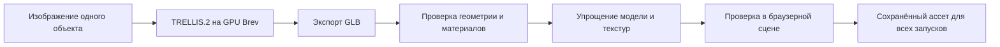

# Сильный визуал и голосовой аким

Обновлено 23 сентября 2026. Это план реализации, не отчёт о готовом приложении. Текущий этап, подтверждённый Сабыржаном: концепция и ТЗ. Jev / TypeSafe отложен по решению команды.

Актуальное визуальное направление после уточнения команды: **белый архитектурный макет Астаны из открытых данных**. [Исследование, сравнение инструментов и фактическая проверка OSM](astana-open-data-visual.md) заменяют прежнюю идею фотореалистичного города из повторяемых модулей как основной путь.

## Зафиксированные решения

- Хостинг веб-приложения и серверных маршрутов: Vercel.
- Авторизация и сохранение сценариев: Supabase.
- Русский README с диаграммами, локальным запуском, URL Vercel и отдельным демонстрационным логином/паролем только в README.
- Бюджеты: $50 OpenAI API и отдельно $50 NVIDIA Brev. Это не взаимозаменяемый баланс.
- Приоритет: выразительная 3D-сцена и голосовое обсуждение инициатив с подтверждением перед изменением плана.
- Доступ к моделям OpenAI и производительность сцены ещё не проверены запросами. Brev CLI установлен и авторизован, каталог GPU просмотрен; платный инстанс не запускался.

## Как выглядит экран

**Это предоставленный командой скриншот внешней платной модели, не наша сцена.** Источник и статус проверки указаны в [исследовании](astana-open-data-visual.md). Для принятия визуала нужен реальный кадр из браузера и проверка движения камеры.

Прежний [фотореалистичный концепт](../design/city-concept-v1.png) остаётся архивным вариантом. Новый ориентир обходится без подробных текстур фасадов: выразительность дают планировка, силуэты, дороги, деревья и свет. Точное повторение платной модели по деталям и охвату не подтверждено. Первый работающий участок должен показать фактическое качество.

Город занимает примерно 80% экрана. Камера смотрит под углом сверху: голубая река, мосты, белые кварталы с дворами, несколько высотных ориентиров, серые дороги и зелёные парки. Здания отличаются формой, высотой и крышами. Свет направленный, тени мягкие; фон скрывается лёгкой атмосферной дымкой.

Верхняя компактная панель: бюджет, число решений, базовый или итоговый Score с явной подписью. Снизу — голосовой советник и короткая расшифровка. Справа — карточка текущего предложения. Район выделяется тонким контуром; планируемое здание полупрозрачное.

Для кейса используются пять условных игровых районов. Основа улиц и застройки предлагается из OSM Астаны; игровые границы и места инициатив не являются точной картой административного деления или реальных планов строительства.

Три важных состояния:

1. **Предложено:** камера показывает участок; здание-призрак; бюджет ещё не изменён.
2. **Принято в план:** предложение записано, бюджет зарезервирован; появляется объект с подписью «Запланировано». Его появление визуализирует план, а не мгновенное наступление эффекта без лага.
3. **Результат через два года:** после пяти допустимых решений включается показ рассчитанного результата и финальных объектов.

## Как получить качество

Качество определяют архитектурные детали, общий художественный стиль, свет, композиция камеры и движения. Один красивый сгенерированный кадр сам по себе не создаёт управляемую 3D-сцену.

Предлагаемая основа: Next.js/TypeScript и клиентская сцена Three.js с React Three Fiber. Конкретные версии закрепляются при создании проекта. Ассеты подготавливаются заранее и загружаются в браузер, чтобы действие игрока не ожидало новой генерации.

| Этап | Что делаем | Проверяемый результат |
| --- | --- | --- |
| 1. Художественное направление | Белые здания, серые дороги, зелёные парки, голубая вода, направленный свет | Внешний референс команды и описание; свой рендер ещё не создан |
| 2. Один эталонный участок | Импорт OSM через Blosm base, проверка высот и частей, камеры и света | Рабочий браузерный кадр и плавный облёт |
| 3. Доработка | Ориентир, повторяемые деревья, дорожки, мосты и места инициатив | Единый стиль и масштаб, приемлемый вес файлов |
| 4. Охват пяти игровых районов | Расширяем проверенный импорт секторами, делаем упрощённый общий план | Все районы доступны; центральный участок не подменяет весь город |
| 5. Особые объекты | Школа, поликлиника, транспортный узел или ориентир | Каждый объект отдельно загружается и заменяется |
| 6. Свет и материалы | Тени, окружающее освещение, материалы фасадов и дорог, вода, умеренная постобработка | Похожий вид при движении камеры, отсутствие засветов и мерцания |
| 7. Жизнь и решения | Машины по заданным путям, автобус, плавная камера, появление объектов | Изменения синхронизированы с подтверждённым планом |
| 8. Производительность | Повторное использование геометрии, ограничение теней и разрешения, оптимизация текстур | Измеренный FPS на ноутбуке команды |

Первоначальная цель приёмки: 1080p, не ниже 30 FPS в основном сценарии; 60 FPS — желаемая цель. Это целевые показатели, а не измеренные результаты. Декоративный фон может быть проще; важные для решений участки остаются настоящими отдельными 3D-объектами.

Оценка бюджета первой проверки качества — 45–60 минут после начала реализации: один участок, камера, свет, одно здание-призрак; установка инструментов может увеличить срок. Если такой кадр выглядит слабо, сначала исправляем импорт, материалы и композицию, затем расширяем охват.

## Генерация ассетов и роль NVIDIA Brev

Основная застройка предлагается из OSM через Blosm base с художественной доработкой. Источники, лицензии и изменения фиксируются в репозитории. Генерация 1–3 отдельных объектов, например поликлиники или школы, остаётся необязательным экспериментом после проверки основного города. Описанный ниже путь TRELLIS.2 не требуется для импорта геоданных.

Исходное изображение: один объект целиком, чистый фон, без обрезки и перекрытия деревьями, ракурс в три четверти, нейтральный свет. Генерировать весь город одним объектом неудобно: нужны независимые районы, здания, дороги и состояния мер.

По [официальному README TRELLIS.2](https://github.com/microsoft/TRELLIS.2), модель поддерживает image-to-3D, PBR-материалы и GLB-экспорт. Требуются Linux и NVIDIA GPU минимум с 24 ГБ памяти; разработчики проверяли A100/H100. Установка включает CUDA-зависимости. Заявленные времена генерации относятся к H100 и не включают всю нашу установку, скачивание, очистку и интеграцию.

**Критерий допуска в основной pipeline:** один объект реально сгенерирован, GLB скачан, открыт в целевой сцене, проверен с нескольких сторон и не ломает производительность. До этого TRELLIS.2 на Brev — техническая гипотеза. При неудаче используем подготовленный модуль, не блокируя основной сценарий.

После генерации проверить: заднюю сторону и крышу, окна и силуэт, масштаб, положение точки привязки, прозрачность, материалы и размер текстур. Сократить число полигонов, подготовить упрощённый вариант для дальнего плана. Возможные инструменты подготовки: Blender и средства оптимизации glTF; конкретный набор выбрать при реализации.

[NVIDIA Brev](https://docs.nvidia.com/brev/latest/) предоставляет GPU-окружение для такой подготовки. Отрисовка опубликованного города происходит на GPU устройства пользователя. Само наличие облачного GPU не повышает FPS браузера. Расходы GPU, хранения и поведение остановки инстанса нужно проверить в выбранной конфигурации до запуска.

## Голос: подходит ли GPT-Live 1

Да: идея голосового акима напрямую использует разговор с перебиваниями, уточнение намерения и делегирование действий. Официальное имя модели — **`gpt-live-1`**. Она поддерживает одновременное слушание и речь, а сложные задачи передаёт серверной модели или нашему обработчику. [GPT-Live](https://developers.openai.com/api/docs/guides/live), [модель](https://developers.openai.com/api/docs/models/gpt-live-1).

Пример целевого взаимодействия:

> Игрок: «Предложи поликлинику в Нуре».
>
> Советник после расчёта: «Это 20 единиц. К концу двух лет показатель медпомощи вырастет с 35 до 43.75. Мера начинает действовать после трёх кварталов. Добавить в план?»
>
> На карте: камера приближается к Нуре, появляется здание-призрак, карточка стоимости и подтверждения.
>
> Игрок: «Да, добавь».
>
> Сервер подтверждает изменение. Слот плана заполняется, бюджет становится 80, объект помечается как запланированный. Советник сообщает: «Добавлено в план».

При «Нет, пока не надо» исчезает только предпросмотр. При «А лучше школу» прежнее предложение заменяется новым и требует нового подтверждения. Если район не указан и не выбран в интерфейсе, советник спрашивает его.

В первой версии достаточно одного голосового советника. Он может объяснять последствия для жителей через данные кейса. Опросы нескольких AI-персонажей — отдельная необязательная механика.

## Технический путь голоса

1. Пользователь входит через Supabase Auth и нажимает «Обсудить решение».
2. Браузер запрашивает микрофон и создаёт WebRTC-подключение. Серверный маршрут Vercel проверяет сессию и лимиты, создаёт GPT-Live-сессию с серверным API-ключом.
3. Для первой проверки используем Responses delegation: GPT-Live ведёт разговор, выбранная backend-модель OpenAI получает инструменты приложения. Модель backend выбирается по доступу, качеству русского языка и задержке.
4. Инструмент `preview_decision` вызывает наш движок. Возвращает предложение с ценой, эффектами, конфликтами, `proposal_id` и версией текущего плана. Камера и карточка используют тот же ответ.
5. Подтверждение конкретного актуального предложения приходит от игрока голосом или кнопкой. Одного вывода модели о том, что «всё подтверждено», недостаточно: приложение хранит состояние предложения и событие подтверждения.
6. `apply_proposal` проверяет авторизацию, версию плана, подтверждение и допустимость изменения. Повтор того же запроса не списывает бюджет второй раз. Устаревшее или отклонённое предложение не применяется.
7. Только после серверного успеха обновляются Supabase, UI и статус объекта; советник сообщает об исполнении.

Названия инструментов — предлагаемый контракт нашего приложения, не встроенные инструменты OpenAI. Незавершённые транскрипты не считаются подтверждением. Перебивание голоса не отменяет автоматически серверную работу; отмена предложения фиксируется в приложении и проверяется перед изменением плана.

Для неполного плана валидатор проверяет допустимость очередного добавления; он не требует уже иметь пять решений. Полная проверка и итоговый Score применяются при завершении плана из пяти мер. Прогноз отдельного показателя допустим до этого.

Официальный [WebRTC quickstart](https://developers.openai.com/api/docs/guides/voice-webrtc?api=live) описывает обмен через `POST /v1/live/sessions`, серверное хранение ключа и требование HTTPS/localhost. [Delegation and tools](https://developers.openai.com/api/docs/guides/live-delegation) описывает передачу вызовов функций и результатов. SDK и события GPT-Live необходимо брать из этих документов, не копировать протокол Realtime без адаптации.

При недоступности Live на аккаунте возможен отдельный вариант на Realtime API или цепочке распознавание → модель → озвучка. Его выбирать по фактическому пробному запросу; это другой способ реализации, с отдельной проверкой задержки и стоимости.

## Бюджет

На 23 сентября 2026 официальный [тариф GPT-Live 1](https://developers.openai.com/api/docs/pricing) — **$0.05 за минуту голосовой сессии**, с посекундным учётом. Backend-модель и инструменты оплачиваются отдельно. 60 минут соединения соответствуют $3 только за голосовую сессию. При создании WebRTC-сессии учитывается 15 секунд инициализации, которые засчитываются в длительность работающей сессии; повторные неудачные подключения также нужно учитывать.

Предложение по резервированию $50 OpenAI, не прогноз фактического расхода:

- До $10 на изображения для нескольких ассетов.
- До $15 на голос, серверную модель и репетиции.
- $25 в резерве на демонстрацию и исправления.

По Brev сначала проверить тариф выбранной GPU и стоимость первого завершённого ассета. Предлагаемый начальный лимит эксперимента — $10 из $50; остальное использовать только после успешной проверки. Эти кредиты не требуют обязательного полного расходования.

При публичном demo-логине вводятся серверные ограничения числа и длительности AI-сессий. Закрывать голосовую сессию при завершении разговора; отключение микрофона само по себе не означает завершение оплачиваемого соединения.

## Вход и сохранение

Для жюри создаётся отдельная demo-учётная запись Supabase Auth с подтверждённым email и паролем. Данные входа публикуются в корневом README. Вход по email и паролю описан в [Supabase Auth](https://supabase.com/docs/guides/auth/passwords).

Одна общая учётная запись означает один общий пользовательский ID. Отдельный `run_id` для каждой игры предотвращает случайное перезаписывание активных планов, но сам по себе не обеспечивает приватность между людьми, знающими общий пароль. Данные остаются демонстрационными. Исходный датасет и контрольный план защищены от перезаписи пользовательскими сценариями.

Права на таблицы и серверные маршруты задаются явно. [RLS Supabase](https://supabase.com/docs/guides/database/postgres/row-level-security) не заменяет проверку бизнес-правил, актуальности предложения и лимитов AI.

## Проверки перед выбором реализации

- Голос: реальный запрос на аккаунте, русский язык, имена районов, отказ, исправление, повтор подтверждения, недоступный микрофон, шум и перебивание.
- Действие: preview не тратит бюджет; apply требует подтверждение; отклонённое предложение не оживает после позднего ответа.
- Визуал: один квартал с целевым светом, камера, призрак здания и переход к принятому плану.
- Генерация: один GLB проходит полный путь; отдельно оценить время подготовки и цену.
- Совместная работа: два браузера под demo-логином не перезаписывают текущие планы друг друга.
- Сдача: README на русском, фактический URL, проверенные credentials, точные команды локального запуска, диаграмма, лицензии, ограничения и результаты проверок.

Проверена документация, создан ранний визуальный концепт, сохранён новый внешний референс и исследован небольшой реальный участок OSM. Brev CLI авторизован. Импорт геометрии, экспорт GLB, платное GPU-окружение, голосовой звонок и FPS ещё не проверялись.
