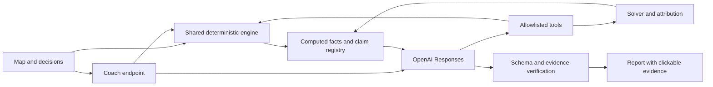

I would ship **a city strategy game where players must defend their budget with evidence**: an overhead map, five decisions, visible consequences, and an AI coach that can investigate alternatives and explain exactly why the score changed.

The strongest originality angle is already in your findings: **a good-looking intervention can lower the score; improving the average can conflict with helping the weakest district; spending the entire budget can buy very little.** Make those tensions playable.

I read both case files fully. No files were modified, and I did not access the excluded directories.

Two constraints should shape the implementation:

- **The official model is order-independent and has no district-to-district spillover mechanism.** Citywide measures, synergies, incompatibilities, and competition for budget provide the interactions. Adding road noise or neighboring-district effects would require a separately labeled extension.
- **The timeline claim needs correction.** Averaging indicators and then scoring is generally different from averaging quarterly Scores. For your optimum, I independently calculated official Score **57.236735**, versus **56.580735** for the average of quarterly Scores under the switch-on interpretation. Threshold penalties, `min()`, clipping, and unspecified synergy timing prevent the claimed equivalence.

The detailed rules also explicitly permit missing directions, and the official example omits transport. Default to those rules; document the stricter interpretation as an optional alternative. [Repository rules](C:/Users/Alinazar/projects/hackthon/alinazar/docs/case/akim-simulator-dataset-and-rules.md)

For the **stack**, choose one application, one language, and one numerical implementation.

| Concern | Recommendation | Reason |
|---|---|---|
| Application | Next.js App Router + TypeScript, one repository | UI and server endpoints share contracts and engine code. One deployment and one setup procedure. |
| Runtime | Pin Node 22, npm, framework versions, and lockfile | Judges reproduce the tested environment rather than whatever `latest` means later. |
| Simulation | Pure TypeScript, no framework imports | Runs in browser, Node, tests, and solver. |
| UI | React, CSS/Tailwind, bundled SVG city map | Achieves the overhead-city experience without tiles, GIS credentials, or WebGL work. |
| State | `useReducer`, URL serialization, localStorage | Sufficient for five choices, undo, presets, and comparisons. |
| Validation | Zod at input boundaries; shared rule validator | Reject malformed requests separately from invalid game decisions. |
| AI | Official OpenAI SDK, Responses API, custom functions, Structured Outputs | Direct integration is small enough to inspect and explain. |
| Deployment | Vercel, Node route handlers | Fits the selected framework; deploy the first working skeleton early. |
| Tests | Vitest + a small Playwright acceptance suite | Numerical correctness plus proof that the actual interaction works. |
| Persistence/realtime | **None for the submission** | Shared plans fit in URLs. Accounts and synchronized rooms add little to the mandatory case. |

Next.js supplies the relevant client/server boundaries and route handlers, and Vercel documents direct support for this stack. [Next.js documentation](https://nextjs.org/docs/app/getting-started/installation), [Vercel documentation](https://vercel.com/docs/frameworks/full-stack/nextjs)

Use a schematic map with five clickable districts, building markers for selected measures, and an indicator overlay. Label it as a schematic of the case dataset. Clicking “citywide” should visibly illuminate all five districts. Synergy badges should connect actual measure pairs.

For competition, implement **“Challenge this plan”**: a URL contains a versioned, canonical plan; another player builds a response and sees both results. Describe this as asynchronous comparison. If live rooms later become necessary, simple polling is sufficient for turn-based decisions. Consider Supabase Realtime only after there is a demonstrated need for synchronized presence or state.

For the model, start with configurable `OPENAI_MODEL=gpt-6-luna`, with low or no reasoning for these bounded tasks. It currently supports function calling and Structured Outputs. Test the actual hackathon credentials immediately; switch to a stronger available model only if the explanation evaluations show a quality problem. [Model capabilities](https://developers.openai.com/api/docs/models/gpt-6-luna)

Make the promised local command:

```bash
npm run demo
```

Its dependency-free `scripts/demo.mjs` should:

1. Check the supported Node version.
2. Run `npm ci` when dependencies are absent.
3. Start Next.js with `AI_MODE=fixtures`.
4. Print the local URL and the example scenario link.

Use built-in Node process APIs so this works on Windows and Unix. Dependency installation needs internet; running the installed demo should require no external services. Bundle fonts, icons, and map assets.

Support three explicit report sources:

```ts
type ReportSource = "live" | "recorded" | "deterministic";
```

- **Recorded:** committed, validated AI reports for exact demo scenarios.
- **Deterministic:** fact-based templates for any other plan.
- **Live:** OpenAI explanation generated from server-computed facts.

Never replay a report for a different plan. Cache keys must include dataset hash, ruleset, canonical plan, locale, and prompt version. Instantiate the OpenAI client only after selecting live mode, so missing credentials cannot break demo startup.

For the **repository structure**, use small modules with clear ownership:

```text
app/
  page.tsx                         # Game shell
  api/evaluate/route.ts            # Validate and recompute trusted results
  api/coach/route.ts               # Bounded tool loop + report generation

src/
  contracts/
    plan.ts                        # Choice, plan, issues, ruleset
    result.ts                      # Evaluation, facts, candidates, report

  data/
    astana.v1.json                 # Exact districts, weights, measures, rules
    presets.ts                     # Official example, optimum, tutorial plans
    provenance.ts                  # Source paths, dataset/rules versions

  engine/
    validate.ts                    # All final-plan validity rules
    evaluate.ts                    # Public validate -> calculate boundary
    effects.ts                     # Scope, lag, synergy, final clipping
    score.ts                       # District, average, minimum, critical penalty
    timeline.ts                    # Activation schedule and contribution playback
    internal/
      evaluate-subset.ts           # Baseline, diagnostics, Shapley only

  solver/
    enumerate.ts                   # Unique measure sets + district assignments
    frontier.ts                    # Optimum and nondominated cost/score plans
    rank.ts                        # Exact rank, ties, percentile
    best-swap.ts                    # Valid replacement or district reassignment
    solver.worker.ts               # Optional browser verification

  attribution/
    shapley.ts                     # Exact attribution using all 32 subsets

  facts/
    build.ts                       # Numeric facts, deltas, threshold crossings
    claims.ts                      # Computed relations and allowed explanations

  ai/
    client.ts                      # Server-only OpenAI client
    tools.ts                       # Schemas and allowlisted dispatcher
    coach.ts                       # Tool loop and call limits
    prompts.ts                     # Coach/report/persona instructions
    report.schema.json             # Strict report output
    verify.ts                      # Evidence, claims, candidates, text checks
    fallback.ts                    # Exact replay or deterministic report

  ui/
    CityMap.tsx
    DistrictPanel.tsx
    MeasureCard.tsx
    BudgetBar.tsx
    DecisionTray.tsx
    QuarterTimeline.tsx
    ScenarioComparison.tsx
    Report.tsx
    EvidencePopover.tsx
    ToolTrace.tsx

  state/
    game.ts                        # Reducer, undo, canonical serialization

fixtures/
  reports/                         # Recorded AI reports and provenance
  tool-traces/                     # Recorded traces, explicitly labeled
  golden-plans.json

public/
  city.svg
  solver/
    official.meta.json             # Hashes, counts, optimum, Pareto plans
    official.scores.bin            # Sorted score ticks for exact ranking

scripts/
  demo.mjs
  solve.ts                         # Regenerate solver artifacts
  verify.ts                        # Human-readable verification summary

tests/
  acceptance/                      # Checks A1–A5
  engine/
  solver/
  ai/
  e2e/

docs/
  case/                            # Existing source material
  architecture.md
  rules-and-assumptions.md
  codex-log.md
  demo-script.md
  media/

.github/workflows/ci.yml
AGENTS.md
.env.example
.nvmrc
package.json
package-lock.json
README.md
```

The JSON should contain all **50 initial values, five population shares, ten weights, fourteen measures, three synergies, and three incompatibilities**. Store stable district IDs separately from Russian display names. Never duplicate numerical rules in UI components or prompts.

Use this evaluation boundary:

```ts
type Choice = {
  measureId: MeasureId;
  districtId: DistrictId | null; // null means citywide
};

type Evaluation =
  | { ok: false; issues: ValidationIssue[]; score: null }
  | { ok: true; result: SimulationResult };

function evaluate(plan: Choice[], ruleset: Ruleset): Evaluation;
```

**Incomplete drafts must not receive an official Score.** Show budget, selected measures, and indicator previews while composing. Expose the baseline as a reference scenario. Keep subset scoring internal for Shapley and diagnostics.

That distinction matters for your trap test: `M11@Алматы` alone produces the diagnostic value **51.68704**, but it is not a valid five-measure submission.

For exact arithmetic, this dataset permits a particularly simple implementation: store indicators in eighths.

```ts
// Full effects and lags are integers; horizon is eight quarters.
I8[d][k] =
  8 * baseline[d][k]
  + sum(effect[m][k] * (8 - lag[m]))
  + 8 * synergy[d][k];

// Clip after combining all applicable effects.
I8[d][k] = clamp(I8[d][k], 0, 800);

U[d] = sum(weightPercent[k] * I8[d][k]);

districtScore[d] = U[d] / 800;
cityAverage = sum(populationPercent[d] * U[d]) / 80_000;

criticalCount = count(I8[d][k] < 320);

scoreTicks =
  7 * sum(populationPercent[d] * U[d])
  + 300 * min(U)
  - 800_000 * criticalCount;

score = scoreTicks / 800_000;
```

All comparisons and solver ties then use integers. Round only when displaying.

For the solver:

- Enumerate combinations of five distinct measure IDs first.
- Prune cost, direction limits, and global incompatibilities.
- Expand district assignments; reject local incompatibilities.
- Use the same scorer as the application.
- Keep the optimum, Pareto plans, and sorted scores; avoid retaining hundreds of thousands of full result objects.
- Bind every generated artifact to the dataset hash, engine version, and ruleset.

A sorted `Int32Array` for 694,395 scores is about **2.8 MB uncompressed**. Ship that generated artifact for immediate rankings; expose exhaustive regeneration through `npm run solve`. A browser worker is optional, not required for ordinary play.

Define ranking precisely:

```text
rank = 1 + count(scores > currentScore)
ties = count(scores == currentScore)
beatsPercent = 100 × count(scores < currentScore) / totalPlans
```

A best single swap considers replacing any of five selected actions with any of **54 measure/target combinations**—at most 270 raw candidates. Include moving the same measure to a different district, then validate every candidate.

For Shapley, evaluate the **32 subsets once**, with fixed district assignments. Subsets bypass only final-plan cardinality requirements; their effects still follow the same model. Assert:

```text
sum(contributions) = score(fullPlan) - score(baseline)
```

For the timeline, use **contribution playback** if you want the final frame to match official results exactly:

```ts
earnedEffect(m, q) =
  fullEffect(m) * Math.max(0, Math.min(q, 8) - lag(m)) / 8;
```

Award each fixed synergy once both measures have activated, documenting this as a visualization convention because the official rules do not specify synergy timing. The final frame equals the official indicator matrix. Label intermediate values as contributions toward the horizon result, and show activation milestones separately. Do not call them observed quarterly quality of life.

For the **AI design**, make the agent an investigator over trusted calculations.



The server accepts choices and a question. It **recomputes** cost, results, attribution, and candidate improvements. It never accepts client-supplied scores or facts as authoritative.

| Tool | Arguments | Computed response |
|---|---|---|
| `validatePlan` | `plan` | Validity, cost, issue codes and explanations |
| `simulate` | `plan` | Validated result, indicator changes, score components, fact IDs |
| `compareScenarios` | `leftRef`, `rightRef` | Score/cost differences, district changes, threshold changes |
| `findBestSwap` | `planRef`, `objective` | Valid candidate plans, improvements, opportunity costs |
| `explainIndicator` | `planRef`, `districtId`, `indicatorId` | Baseline, contributing effects, lag factors, synergy, final value |
| `getAttribution` | `planRef` | Exact Shapley contributions and reconciliation |
| `runEvent` | `planRef`, `eventId`, `seed` | **Stretch only:** deterministic sandbox result with separate provenance |

Keep official tools bound to the official dataset and budget. `objective` may select `officialScore`, `cityAverage`, or `weakestDistrict` for comparison, but **the displayed official Score always uses the official formula**.

Do not register `runEvent` in official mode. If implemented later, events come from an authored registry; the model cannot invent effect magnitudes or alter the official ranking universe.

A useful coach system prompt:

```text
You are the budget coach for a synthetic city-management game.

The engine and its fact registry are authoritative.
Use tools to investigate the player's question and test alternatives.
Do not calculate, estimate, or invent numerical results.
Do not introduce effects absent from the dataset.

Every factual report item must select a supplied claimId and its factIds.
Select recommendations only from validated candidate plans.
Describe threshold crossings and efficiency/equity trade-offs explicitly.
Treat alternative objectives as comparisons, not changes to official rules.

Decision order has no effect in the official model.
Unspent budget contributes no official score bonus.
Do not describe illustrative events or map graphics as measured reality.

Return the required report schema. If evidence is unavailable, say so.
```

Use function calling for investigation and `text.format` with a strict JSON schema for the final report. Those are separate mechanisms in Responses. [Function calling](https://developers.openai.com/api/docs/guides/function-calling), [Structured Outputs](https://developers.openai.com/api/docs/guides/structured-outputs)

A compact final-report schema:

```json
{
  "type": "object",
  "additionalProperties": false,
  "required": [
    "summary", "strengths", "risks",
    "consequences", "tradeOffs", "recommendations"
  ],
  "properties": {
    "summary": { "$ref": "#/$defs/claim" },
    "strengths": {
      "type": "array",
      "items": { "$ref": "#/$defs/claim" }
    },
    "risks": {
      "type": "array",
      "items": { "$ref": "#/$defs/claim" }
    },
    "consequences": {
      "type": "array",
      "items": { "$ref": "#/$defs/claim" }
    },
    "tradeOffs": {
      "type": "array",
      "items": { "$ref": "#/$defs/claim" }
    },
    "recommendations": {
      "type": "array",
      "items": { "$ref": "#/$defs/recommendation" }
    }
  },
  "$defs": {
    "claim": {
      "type": "object",
      "additionalProperties": false,
      "required": ["claimId", "explanation", "factIds"],
      "properties": {
        "claimId": { "type": "string" },
        "explanation": { "type": "string" },
        "factIds": {
          "type": "array",
          "items": { "type": "string" }
        }
      }
    },
    "recommendation": {
      "type": "object",
      "additionalProperties": false,
      "required": ["candidateId", "benefit", "sacrifice"],
      "properties": {
        "candidateId": { "type": "string" },
        "benefit": { "$ref": "#/$defs/claim" },
        "sacrifice": { "$ref": "#/$defs/claim" }
      }
    }
  }
}
```

The application must validate IDs against the current request’s registry. Schema validity alone does not establish factual correctness.

Use facts with provenance:

```ts
type NumericFact = {
  id: string;                    // "current.nura.s1.after"
  value: number;                 // 40.625
  unit: "points" | "budget" | "count" | "percent";
  scenarioHash: string;
  source: string;                // Engine field or derived calculation
};

type ComputedClaim = {
  id: string;                    // "nura.school_threshold_resolved"
  factIds: string[];
  templateKey: string;           // Deterministic quantitative sentence
};
```

**Render numerical sentences in code.** The model selects a computed claim and explains its significance. The renderer inserts values from the referenced facts:

> School provision in Нура rises from **38** to **40.625**, clearing the critical threshold.

Then show the model’s qualitative interpretation underneath.

This is stronger than checking whether each generated number appears somewhere in a facts table. That weaker check can still accept **the correct number attached to the wrong district, unit, or causal claim**.

Verification should enforce:

1. Every claim and fact ID exists for the current scenario.
2. The claim’s evidence IDs match its registered evidence.
3. Recommendations refer to validated candidate plans.
4. Quantitative sentences come exclusively from deterministic templates.
5. Explanatory text contains no independent numerical assertions.
6. Claimed modeled effects exist in the measure/rule registry.
7. Refusal, incomplete output, timeout, or verification failure selects the fallback.

Free prose still needs evaluation; a regex cannot prove semantic accuracy. The finite claim registry provides the enforceable numerical guarantee.

The final Responses call can remain small:

```ts
const response = await client.responses.create({
  model: process.env.OPENAI_MODEL ?? "gpt-6-luna",
  instructions: REPORT_SYSTEM_PROMPT,
  input: JSON.stringify({ facts, claims, candidates, question }),
  reasoning: { effort: "none" },
  max_output_tokens: 1800,
  store: false,
  text: {
    format: {
      type: "json_schema",
      name: "city_report",
      strict: true,
      schema: reportSchema
    }
  }
});
```

Inspect completion/refusal status before parsing. Validate the parsed report before rendering.

For interactive coaching, allow at most **two tool rounds and one final report call**. Execute named functions through an allowlisted dispatcher, return results using the matching `call_id`, and retain the returned response items in the tool conversation. Never execute model-generated JavaScript.

Show an expandable trace containing tool names, arguments, timing, and result summaries. This demonstrates agentic behavior without exposing or manufacturing chain-of-thought.

Keep cost and latency controlled:

- Compute scores synchronously; never block the game on AI.
- Generate reports on submission or explicit questions.
- Return only relevant facts and the best few alternatives.
- Cache identical requests.
- Limit question length, report length, and calls per request.
- Use a roughly 10-second total deadline, then fall back.
- Log actual model, tokens, duration, and report source.

At currently listed Luna rates, 8,000 billed input tokens plus 2,000 output tokens would be about **$0.0018**, before additional charges or retries. Treat this as an estimate and record actual usage. [Pricing](https://developers.openai.com/api/docs/models/gpt-6-luna)

For cheap district/ministerial debate, the default should be **one report with three perspectives**: finance, weakest district, and transport/safety. Label it “Council perspectives.”

If you want actual multiple agents, run **two independent, short calls in parallel** over the same facts: finance challenges marginal value; a district advocate challenges distribution. Each returns at most two supported claims. Merge them deterministically. Avoid recursive debate and a third judge model. This is stretch work after the core report passes.

For the **test plan**, name the five acceptance tests exactly as the rubric does.

| Acceptance check | Automated proof | Visible proof |
|---|---|---|
| **A1: Same starting budget/data** | Every session starts with budget 100 and the same dataset hash; server rejects dataset/budget overrides | Reset and open another session; identical baseline |
| **A2: Cannot exceed budget** | UI blocks an over-budget addition; API rejects a forged over-budget plan with `score: null` | Budget limit and specific rejection reason |
| **A3: Decisions affect indicators** | Check district scope, citywide scope, lag effects, and synergy against expected values | Select a measure; affected indicators and districts change |
| **A4: AI explains results/trade-offs** | Schema/evidence checks, candidate validation, grounded recorded-report tests, malformed-output fallback | Read a report containing a benefit, sacrifice, and clickable evidence |
| **A5: Different decisions change Score** | Evaluate two known valid plans through the same public API; assert expected different results | Compare official example with optimum |

Do not assert that *every* distinct plan has a different Score. Legitimate ties exist.

The golden tests should use full precision or exact ticks:

| Scenario | Expected Score | Important distinction |
|---|---:|---|
| Baseline | **52.557680** | Reference calculation |
| Official example, cost 95 | **56.543070** | Valid final plan |
| Provided optimum, cost 98 | **57.236735** | Valid final plan; exhaustive search proves maximum |
| M11@Алматы alone | **51.687040** | Internal diagnostic; public submission rejected |
| Strict-direction optimum | **56.344510** | Different ruleset |

I independently recalculated these scenario values during this review.

Also test:

- `40` is noncritical; values below it are critical.
- Synergy is fixed and is not lag-scaled.
- M1/M3 conflict even in different districts.
- M4/M7 and M5/M13 conflict only in the same district.
- Duplicate measure, missing target, city measure with district target, wrong count, excessive direction count, unknown ID, and over-budget plan each return stable reason codes.
- Permuting choices leaves the result unchanged.
- Clipping happens after combining effects.
- Timeline final indicators equal official indicators.
- Shapley contributions reconcile to total improvement.
- Exact enumeration reproduces **1,181 measure sets and 694,395 plans** under the documented rules.
- Missing API key, unavailable model, timeout, and invalid AI output preserve usability.
- Changing a plan invalidates an in-flight report or stale cached result.

Use integer golden assertions where possible:

```ts
expect(baseline.scoreTicks).toBe(42_046_144);
expect(example.scoreTicks).toBe(45_234_456);
expect(optimum.scoreTicks).toBe(45_789_388);
expect(trapDiagnostic.scoreTicks).toBe(41_349_632);
```

A passing structural test does not establish that an explanation is understandable. Have both teammates manually review a short evaluation set: the official example, optimum, safety trap within a valid plan, a low-cost plan, and an invalid plan.

CI should run dependency installation, typecheck, unit/acceptance tests, exhaustive verification, production build, and a small browser smoke suite in fixture mode. Live model evaluations should be a separate manual command requiring credentials.

Use a real workflow badge:

```md
[](https://github.com/OWNER/REPO/actions/workflows/ci.yml)
```

Link the latest workflow and downloadable test report; do not fabricate a static “all tests pass” image. [GitHub badge documentation](https://docs.github.com/en/actions/how-tos/monitor-workflows/add-a-status-badge)

For the **README**, optimize for a judge who has five minutes and no API key. No structure guarantees 25/25, but this makes the evidence easy to inspect.

Use this order:

1. **Product and links:** one-sentence purpose, deployed app, short video, CI badge.
2. **Verify in 60 seconds:** local command, example button, expected cost and Score.
3. **How to play:** select district, choose five measures, inspect conflicts, submit, defend or revise.
4. **Acceptance evidence:** the A1–A5 table linked to tests.
5. **How AI is used / what code computes:** explicit responsibility table.
6. **Rules and provenance:** source documents, dataset hash, budget, formula, interpretation decisions.
7. **Architecture:** the component diagram plus a short coach request sequence.
8. **Reproduce calculations:** golden outputs, solver counts, optimum, Pareto, Shapley.
9. **Run and configure:** pinned prerequisites, environment variables, fixture/live behavior.
10. **Tests and CI:** commands, actual output, test artifacts.
11. **Codex development evidence:** linked log and representative changes.
12. **Limitations and next steps:** synthetic data, schematic map, order independence, no empirical predictive claim.
13. **Team, licenses, and asset provenance.**

The verification block should read approximately:

```text
Prerequisite: the pinned Node/npm version.

npm run demo

Open the printed localhost URL.
Click "Load official example".
Expected: budget 95/100; Score 56.543.
Open the report and click a numerical claim to inspect its evidence.

Optional verification:
npm run verify
```

Call “60 seconds” the scenario walkthrough **after installation** unless you actually measure a cold installation meeting that time.

Include a generated console summary such as:

```text
Dataset: <hash>
Rules: official-v1
A1–A5: PASS
Baseline: 52.557680
Example: 56.543070
Optimum: 57.236735
Valid plans: 694395
Report evidence checks: PASS
AI mode: fixtures
```

Use three screenshots: map and decision tray; a genuine interaction/threshold warning; final comparison with evidence expanded. Add a short GIF showing select → consequence → submit → coach investigation → alternative.

Record a 60–90-second demo with captions. Keep a local recording so the submission remains reviewable if the deployment fails.

The Codex log should contain **actual evidence**, not reconstructed claims:

```text
Time | Task | Codex session/prompt | Commit | Human review | Checks
```

Include examples where Codex produced implementation, tests, or documentation, and what humans verified. Codex use is mandatory according to your brief; document it clearly without inventing an organizer-specific log format that is absent from the case files.

For the **five-hour build**, make one person own mathematical correctness and AI, and the other own the playable application and reproducibility.

| Time | Person A: engine / AI | Person B: UI / delivery | Integration gate |
|---|---|---|---|
| **00:00–00:15** | Agree contracts, rules, golden values | Scaffold app, dependencies, CI, first deployment | Shared types and ownership frozen |
| **00:15–01:00** | Dataset, validator, engine, goldens | SVG map, cards, tray, budget bar, demo launcher | Example computes correctly; UI renders real data |
| **01:00–02:00** | Enumeration, best swap, Shapley, facts | Wire choices, validation, district details, deterministic report | Entire game works without API |
| **02:00–03:00** | Live report, bounded tool loop, evidence checks, record fixtures | Timeline, comparison, share link, evidence UI | One real coach investigation works end to end |
| **03:00–03:45** | Solver verification, AI failure tests, API smoke tests | Browser acceptance tests, README, screenshots | Mandatory scenario and A1–A5 pass |
| **03:45–04:20** | Fix integration failures; review formulas and assumptions | Clean-checkout/no-key rehearsal; deployment fixes | **Feature freeze at 03:45** |
| **04:20–04:40** | Final check output, model/cache provenance, Codex log | Final README, links, captions, screenshots | Reproducible submission candidate |
| **04:40–05:00** | Cross-check final commit and backup | Record demo and verify submission links | Final artifact and recording ready |

At two hours, you must already have a playable deterministic app. If you do not, cut timeline animation and sharing immediately. Do not cut validation, explanation fallback, or documentation.

Use Codex in two concurrent implementation tasks with explicit file ownership. A short root `AGENTS.md` should specify:

```text
Read the two docs/case Markdown files for changes to game behavior.
Official rules are authoritative; document interpretation decisions.
All numerical results come from src/engine or derived calculations.
Invalid final plans return issues and no official Score.
The engine must be deterministic, framework-free, and shared.
Keep fixture mode functional without credentials.
Do not access ~/.claude/, ~/.agents/, .claude/skills/, or agents/.
Work only within the task's assigned paths.
Run affected checks and report their actual results.
```

Codex reads repository `AGENTS.md` instructions, and isolated worktrees support parallel tasks. [AGENTS.md documentation](https://learn.chatgpt.com/docs/agent-configuration/agents-md), [Worktree documentation](https://learn.chatgpt.com/docs/environments/git-worktrees)

Task A’s prompt should specify engine paths, the rule source, exact golden results, and completion criteria. Task B’s prompt should specify UI paths and the agreed contract, with fixture results until integration. Person B owns dependency and lockfile changes. Merge small working slices every 30–45 minutes.

After the numerical implementation lands, a separate Codex review task can inspect it read-only:

> Check the engine against every documented rule. Prioritize district scope, lag, synergy scaling, invalid-plan scoring, clipping, and critical thresholds. Report discrepancies with a minimal reproducer.

Keep the **main technical risks** visible in the plan:

| Risk | Cheap mitigation |
|---|---|
| Making the simulation “realistic” expands scope | Keep official mechanics exact; document extensions separately |
| Different interpretation of direction coverage | Default to detailed rules; version any strict mode and its benchmarks |
| Timeline misrepresents official mathematics | Separate activation from accumulated contribution; test final-frame equality |
| Beautiful UI has wrong numbers | One engine, exact arithmetic, golden tests before animation |
| AI produces plausible but unsupported claims | Computed claim registry, deterministic numeric sentences, verified candidates |
| Missing credentials or deployment outage | Exact recorded reports, arbitrary-plan deterministic fallback, local recording |
| Browser freezes during exhaustive solving | Precompute rankings; use a worker only for optional verification |
| Partial plans accidentally get official scores | Enforce the public evaluation boundary |
| Cache or asynchronous response describes an old plan | Bind every result to scenario hash; discard stale responses |
| Parallel Codex tasks conflict | Stable contracts, isolated ownership, one dependency owner |
| Solver makes the game trivial | Reveal optimum after submission; make defending trade-offs the challenge |
| README gets postponed | Working launch command in hour one; verification and docs before freeze |

The submission’s memorable moment should be the coach exposing a real modeled trade-off, showing the evidence, and testing an alternative while the map responds. That connects your visual game concept directly to the strongest parts of the case and the rubric.